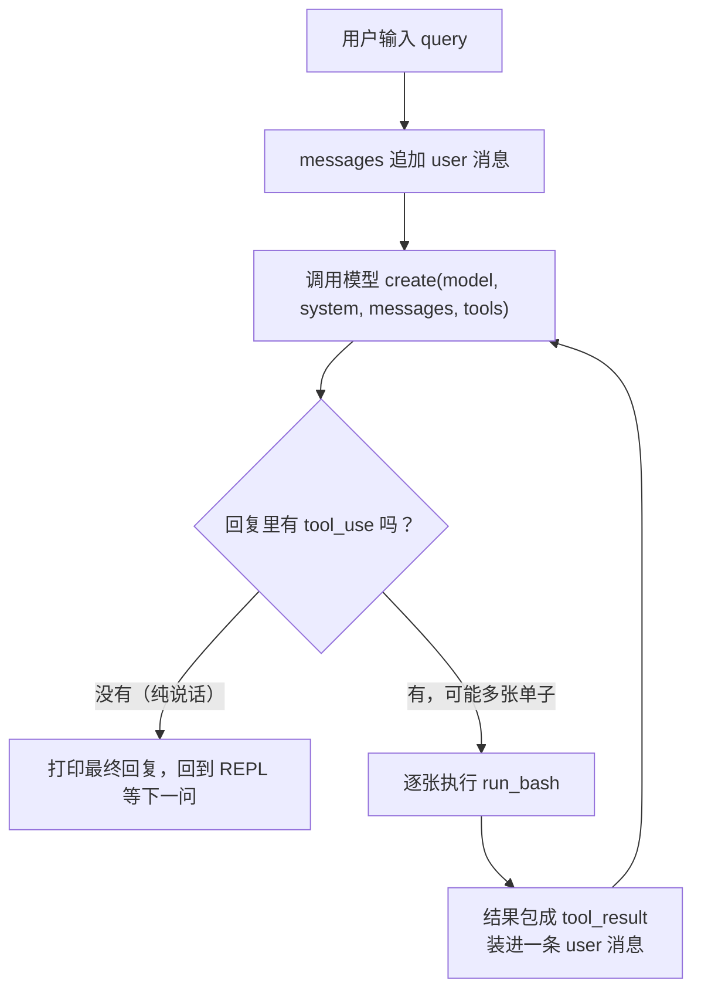

# 第 1 课主教案 · Agent Loop：一个循环 + 一个 bash 工具

## 课程信息卡

| 项 | 内容 |
|---|---|
| 课程编号 | 第 1 课 / 共 18 课 |
| 所属阶段 | 阶段一 · 让 Agent 动起来（第 1–4 课） |
| 本节目标 | 亲手写出并跑通整个项目的"心脏"：带一个 bash 工具的 Agent Loop |
| 上节遗留问题 | 无（本课是起点。起点的问题是：聊天模型只会说，不会做） |
| 本节新增能力 | 一个能真实执行 shell 命令、多轮对话、自主决定停手的命令行 Agent |
| 涉及文件 | `mini_claude/llm.py`、`mini_claude/loop.py`、`mini_claude/__main__.py`、`tests/fakes.py`、`tests/test_lesson01_loop.py` |
| 环境与依赖 | Python 3.12（uv 虚拟环境）、anthropic、python-dotenv、pytest |
| 如何验证 | 离线：`.venv/bin/python -m pytest -q`；在线：`python -m mini_claude` 配 key 后真实对话 |
| 读完你应该能说出 | ① tool_use / tool_result 是什么、分别在哪条消息里；② 循环靠什么判断"该停了"；③ messages 列表在一轮工具调用前后长什么样 |
| 进度地图 | 阶段一 ▶ [**1**]→2→3→4 ‖ 阶段二 5→…→8 ‖ 阶段三 9→…→12 ‖ 阶段四 13 ‖ 阶段五 14→15 ‖ 阶段六 16→17→18 |

---

## 一、定位

### 功能定位

我们的复现仓库现在还是空的（只有一个课程总览）。所以本课要回答的，是一切的第一个问题：**怎么让"会说"变成"会做"？**

答案你在预习里已经知道了：给模型一份工具说明书，它回一张工具调用单，我们替它执行、把结果念回给它，直到它纯说话为止。做完本课，你就拥有了一个真能干活的命令行助手——虽然它只有一个锤子（bash），但记住原项目那句话：**one loop & bash is all you need**。后面 17 课的所有花花本事，都是在这个骨架上挂号子。

### 代码定位

**空间位置**：本课的 `agent_loop` 是整个项目唯一的"主干道"，之后每一课的代码，要么是往这个循环的**前面**加东西（比如压缩上下文、注入通知），要么是往循环的**缝隙里**加东西（比如工具执行前的权限检查），循环本身几乎不再动。你可以把后面 17 课都理解成"往今天这 40 行代码的各个穴位上扎针"。

**时间位置**：为什么第一个写它？因为它是不变量。原项目 README 里有一张图，标题就叫 "THE AGENT PATTERN"——先立住常量，再演化变量，学起来才不慌。也因为它最小：一个工具、一个循环、一百多行，正好一口气吃透。

---

## 二、代码理解

先看全貌。本课一共三个源文件，分工很清爽：

```
mini_claude/
├── __init__.py     # 包标记
├── llm.py          # "快递员"：负责连 API、读配置
├── loop.py         # "心脏"：SYSTEM 提示词 + bash 工具 + agent_loop
└── __main__.py     # "前台"：终端一问一答的 REPL
```

下面逐个文件读。读法建议：每段代码先自己扫一眼，再看老师的解释。

### 2.1 llm.py——把"连模型"这件脏活收进一个函数

```python
import os

from anthropic import Anthropic
from dotenv import load_dotenv


def get_client() -> Anthropic:
    load_dotenv(override=True)
    if os.getenv("ANTHROPIC_BASE_URL"):
        os.environ.pop("ANTHROPIC_AUTH_TOKEN", None)
    return Anthropic(base_url=os.getenv("ANTHROPIC_BASE_URL"))


def get_model() -> str:
    load_dotenv(override=True)
    try:
        return os.environ["MODEL_ID"]
    except KeyError:
        raise SystemExit("缺少 MODEL_ID：请复制 .env.example 为 .env 并填写（参考教案第 1 课）")
```

解释一下，这里有几个第一眼容易困惑的点：

- **`load_dotenv(override=True)`**：我们的 API 地址、key、模型名都写在 `.env` 文件里（就是一行行 `KEY=value` 的文本）。这个函数把文件里的配置读进环境变量，`override=True` 表示文件里的值优先于系统里已有的。为什么要用文件而不是直接写在代码里？因为 key 是秘密，代码要提交到 git，秘密不能进 git。
- **`ANTHROPIC_BASE_URL` 那两行**：如果你配置了兼容厂商的接入地址（比如 GLM、Kimi），SDK 可能会优先拿另一个凭证变量导致鉴权混乱，这里清掉它。现在看不懂没关系，知道"接别的厂商时要处理一个小坑"就行。
- **为什么这些代码包在函数里，而不是直接写在模块顶层？** 这是个值得学走的小设计：原项目的 s01 是在模块顶层直接执行的，导致"只要 import 这个文件，就得有 API 配置"。我们改成函数之后，**导入**和**联网**变成了两件事——离线测试导入这个包随便玩，真正要连 API 时才检查配置。测试能离线跑，秘密就在这。

### 2.2 loop.py——心脏本脏

这个文件分三块：给模型的**人设**、工具的**说明书**、以及**循环**。

**第一块：SYSTEM 提示词**

```python
SYSTEM = (
    "You are a coding agent. Use the bash tool to solve tasks. "
    "Act, don't explain."
)
```

每次调用模型时，这段话都会作为 `system` 参数传过去。它是给模型的"岗位说明书"。注意最后一句 **"Act, don't explain"（去做，别光解释）**——你要是不写这句，模型很可能回答你一段教程而不是真去跑命令。提示词是 Harness 控制 model 行为的第一根缰绳，以后我们会往这里塞越来越多东西（第 5 课的计划清单、第 7 课的技能目录都会注入这里）。

**第二块：工具说明书**

```python
BASH_TOOL = {
    "name": "bash",
    "description": "Run a shell command.",
    "input_schema": {
        "type": "object",
        "properties": {"command": {"type": "string"}},
        "required": ["command"],
    },
}
```

模型**看不到我们的任何 Python 代码**，它对 bash 工具的全部认知就来自这段 JSON：工具叫 bash、用途是跑 shell 命令、输入参数只有一个字符串 `command`、必填。`input_schema` 这种写法叫 JSON Schema——就是用 JSON 格式描述"一个合法的 JSON 长什么样"。你只要记住：**说明书越清楚，模型用得越准**。第 2 课加新工具时，就是照着这个模子再写四份说明书。

**第三块：真正执行命令的函数**

```python
def run_bash(command: str) -> str:
    dangerous = ["rm -rf /", "sudo", "shutdown", "reboot", "> /dev/"]
    if any(d in command for d in dangerous):
        return "Error: Dangerous command blocked"
    try:
        r = subprocess.run(
            command, shell=True, capture_output=True, text=True,
            errors="replace", timeout=120,
        )
        out = (r.stdout + r.stderr).strip()
        return out[:50000] if out else "(no output)"
    except subprocess.TimeoutExpired:
        return "Error: Timeout (120s)"
    except OSError as e:
        return f"Error: {e}"
```

逐点说：

- **`dangerous` 清单**：一个粗糙但有效的保命符——命令里含 `rm -rf /`、`sudo` 这类模式就直接拒绝，不执行。注意它返回的是**字符串错误信息**而不是抛异常，因为这段话最终要作为 tool_result 念给模型听，让它自己换个思路。第 3 课我们会把它升级成正式的权限系统。
- **`subprocess.run(...)`**：Python 标准库里"开一个子进程跑命令"的方法。`shell=True` 表示让系统 shell 来解释命令（这样管道、通配符都能用）；`capture_output=True` 把命令的输出抓回来而不是打到屏幕；`text=True` 让我们拿到字符串而不是字节；`errors="replace"` 保证遇到奇怪编码不至于崩掉；`timeout=120` 防止模型让你跑了个死循环命令把程序挂死。
- **`(r.stdout + r.stderr).strip()`**：标准输出和错误输出拼在一起——对模型来说，报错信息和正常输出一样重要，都是"事实"。
- **`out[:50000]`**：最多给模型念 5 万字符。为什么？模型的一次输入有长度上限，一条命令要是吐出几十万字（比如 `cat` 了个大文件），会把整个对话撑爆。这是原项目作者踩过的坑，第 8 课的"上下文压缩"会正经处理这个问题。
- **空输出返回 `"(no output)"`**：很多命令成功时什么也不说（比如 `mkdir`）。给一句占位话，模型才知道"执行了但没输出"和"根本没执行"的区别。

**第四块，也是全课的主角：循环**

```python
def agent_loop(messages: list, client, model: str) -> None:
    while True:
        response = client.messages.create(
            model=model, system=SYSTEM, messages=messages,
            tools=[BASH_TOOL], max_tokens=8000,
        )

        messages.append({"role": "assistant", "content": response.content})

        tool_calls = [
            block for block in response.content if block.type == "tool_use"
        ]
        if not tool_calls:
            return

        results = []
        for block in tool_calls:
            command = block.input["command"]
            print(f"\033[33m$ {command}\033[0m")
            output = run_bash(command)
            print(output[:200])
            results.append({
                "type": "tool_result",
                "tool_use_id": block.id,
                "content": output,
            })

        messages.append({"role": "user", "content": results})
```

一共就四个动作，我们按执行顺序走一遍：

1. **调用模型**。五个参数各司其职：`model` 是用哪个模型；`system` 是岗位说明书；`messages` 是到目前为止的完整聊天记录——注意是**完整**的，模型没有记忆，它每次都是重读整本记录来理解上下文的，这一点想通了，后面第 8 课"为什么要压缩"就自然通了；`tools` 是工具说明书清单；`max_tokens` 限制单次回复长度。
2. **把回复记进历史**。`response.content` 是内容块列表（预习里的伏笔），我们**原封不动**整个 append 进 messages。为什么不加工一下？因为下一轮调用模型时，API 要求历史里必须保留当时的原始样子，加工了会报错。
3. **挑出工具调用单，判断是否收工**。用列表推导式把 `type == "tool_use"` 的块挑出来。一张都没有（`if not tool_calls`）就 `return`——**这就是模型"自己决定停"的实现，简单到只有一个 if**。
4. **执行并回填**。对每张单子：从 `block.input` 里拿出命令参数（`input` 就是一个字典，对应说明书里的 input_schema），执行，然后把结果包装成 `{"type": "tool_result", "tool_use_id": ..., "content": ...}`。最后**所有结果装进一条 user 消息** append 回去。

这里有个初学者最容易愣住的设计，单独拎出来讲：**为什么工具结果要装在 `role: "user"` 的消息里？** 感觉很怪对吧——明明是程序给的，怎么就"user"了？因为对话 API 的世界里只有两种角色轮流说话：user 和 assistant。模型（assistant）发问"帮我跑这个"，那"替它跑并汇报结果"的一方，在协议眼里就是 user 在说话。`tool_use_id` 是两张单子之间的回执编号——模型发单时每张都有唯一 id，我们回填时注明"这是对哪张单子的回复"，模型才不会张冠李戴。**记住这张回执机制，第 2 课一次回复多张单子的场景全靠它。**

还有个 Python 小语法顺手说一句：`print(f"\033[33m$ {command}\033[0m")` 里的 `\033[33m` 是终端的颜色控制码（黄色），让命令行里 Agent 跑的每条命令高亮显示，`\033[0m` 把颜色关掉。纯装饰，但以后你看 Agent 干活时会感谢这点颜色。

### 2.3 __main__.py——前台 REPL

```python
from . import llm
from .loop import agent_loop


def print_last_reply(history: list) -> None:
    content = history[-1]["content"]
    if isinstance(content, list):
        for block in content:
            if getattr(block, "type", None) == "text":
                print(block.text)


def main() -> None:
    print("mini_claude 第 1 课：Agent Loop")
    print("输入问题回车发送，输入 q 退出。\n")

    client = None
    model = None
    history = []
    while True:
        try:
            query = input("\033[36mmini >> \033[0m")
        except (EOFError, KeyboardInterrupt):
            break
        if query.strip().lower() in ("q", "exit", ""):
            break

        if client is None:
            client = llm.get_client()
            model = llm.get_model()

        history.append({"role": "user", "content": query})
        agent_loop(history, client, model)
        print_last_reply(history)
        print()
```

要点三个：

- **`history` 定义在循环外面**。你在 REPL 里问第二个问题时，第一个问题的完整对话（包括中间跑过的命令和输出）都还在记录本上——这就是多轮对话有记忆的原因。记忆 = 完整历史每次都重发。
- **`agent_loop(history, ...)` 是就地修改**。因为 Python 里列表是引用传递，函数内 append 的内容外面看得见，所以 loop 返回后 `history[-1]` 就是模型的最终回复。
- **client 懒初始化**：第一次真正提问时才连 API。这样你临时想启动看一眼、或直接退出，不需要配好 key。`print_last_reply` 里用 `getattr(block, "type", None)` 而不是直接 `block.type`，是防御 dict 和对象两种块混用时不出错——最后的回复也可能是纯字符串，所以先 `isinstance` 判断。

### 2.4 测试：不花钱的"假模型"

`tests/fakes.py` 是本课的第二主角。思路：模型客户端我们只用到一个方法 `client.messages.create(...)`，那就造一个替身，**按剧本吐出预设的回复**：

```python
def tool_response(command: str, tool_use_id: str = "tool-1"):
    return SimpleNamespace(
        content=[
            SimpleNamespace(
                type="tool_use", id=tool_use_id,
                name="bash", input={"command": command},
            )
        ]
    )
```

`SimpleNamespace` 是标准库里的"属性袋子"，`ns.type` 这样点出来，跟真 SDK 返回的对象在 agent_loop 眼里无法区分（这叫鸭子类型：走路像鸭子叫声像鸭子，那就是鸭子）。`FakeClient` 内部把每次 `create` 收到的参数记进 `calls` 列表——于是测试不但能验证"结果对不对"，还能验证"你传给模型的参数对不对"。这套假模特装备后面 17 课反复复用，是一次性投资。

`tests/test_lesson01_loop.py` 用它演了四个剧本：① 模型纯说话→立即停；② 完整一圈工具调用→验证 messages 四条消息的角色顺序和 tool_result 内容；③ 危险命令→验证拦截信息回填；④ run_bash 函数本身的三种行为。

---

## 三、运行时辅助理解

静态读完，现在让它真的跑一圈。我们的示例输入：

> 用户：「帮我看看当前目录有几个 Python 文件」

用假模型剧本（`tool_response("ls *.py 2>/dev/null | wc -l")` → `text_response("当前目录有 1 个 Python 文件。")`）驱动**真实的** agent_loop 和**真实的** bash 执行，`messages` 列表的完整演化如下（这是老师机器上跑出来的真实数据，不是示意图）：

| 步骤 | 发生什么 | messages 列表状态 |
|---|---|---|
| 0 | 用户输入 | `[0] user: '帮我看看当前目录有几个 Python 文件'` |
| 1 | 第 1 次调用模型，模型出单 | `[1] assistant/tool_use: id=tool-1, name=bash, input={'command': 'ls *.py 2>/dev/null \| wc -l'}` |
| 2 | 本机**真执行**该命令 | 终端打印黄色 `$ ls *.py ...`，subprocess 返回 `"1"` |
| 3 | 结果包成 tool_result 装进 user 消息 | `[2] user/tool_result: {type: tool_result, tool_use_id: 'tool-1', content: '1'}` |
| 4 | 第 2 次调用模型（带着全部 3 条历史），模型纯说话 | `[3] assistant/text: '当前目录有 1 个 Python 文件。'` |
| 5 | 检测不到 tool_use → return | 模型共被调用 **2 次**，循环结束 |

请特别注意两件事：

- **命令是真执行的**。步骤 2 里 subprocess 在我们这台机器上开了 shell 进程，输出 `1` 是磁盘的真实情况（tests 目录外的仓库根此时只有 1 个 py）。模型负责"决定做什么"，我们的代码负责"让事情发生"——分工在第 0 步和第 2 步之间划得清清楚楚。
- **外部状态变化**：本课没有任何数据库或文件写入（无新表无新文件，这点老师按惯例明确交代），唯一的"外部世界"就是 shell 和它的输出。下一课我们给它 write_file 工具后，磁盘文件才会开始被 Agent 改变。

你自己跑的命令（仓库根目录）：

```sh
.venv/bin/python -m pytest -q          # 四个剧本全绿，不需要 key
.venv/bin/python -m pytest tests/test_lesson01_loop.py::test_bash_tool_roundtrip -v   # 单看完整一圈
```

配好 `.env` 后 `python -m mini_claude`，输入你预习小任务里想的那件事，就能看到黄色的命令一行行跑出来。

---

## 四、流程图理解



图后导读：整张图读下来就是一次完整的问答——你在终端敲下的话先被记进 messages（A→B，对应 `__main__.py` 里的 `history.append`），随后流程到达全图唯一会被执行多次的"调用模型"框（C）：第一次它带着你的问题进去，模型回了一张 bash 调用单，于是流程向下进入 `run_bash` 真正开一个子进程执行命令（F，全图唯一接触现实世界的地方，进程、文件、网络都在它那头），输出被包成 tool_result 装进一条 user 消息（G），再绕回 C 把问题重新问一遍；第二次模型看到结果、只回了一段文字，走到菱形分叉（D）时发现没有 tool_use，于是打印回复收场（E）。所谓"循环"，就是 G→C 这条往回绕的边——同一个调用点，每次被喂进越来越长的 messages，这就是循环的图形样子。对照预习里的五行伪代码看一眼，图、伪代码、代码三者互相印证，这是老师建议你以后学每个机制都做一遍的"三对照"。

---

## 五、环境与依赖

本课环境从零到能跑，完整走过一遍（你重装机器也能照抄）：

| 步骤 | 为什么 | 命令 | 验证 |
|---|---|---|---|
| 1. 装 uv | 系统自带 Python 是 3.8，太老；uv 能自动下载管理新版 Python，建虚拟环境也快 | 见 [uv 官方安装](https://docs.astral.sh/uv/)，本机已有：`~/.local/bin/uv` | `uv --version` |
| 2. 建虚拟环境 | 项目依赖装在 `.venv` 沙盒里，不污染系统、版本固定 | `uv venv --python 3.12` | 出现 `.venv/` 目录 |
| 3. 装依赖 | anthropic（发 API 请求）、python-dotenv（读 .env）、pytest（跑测试） | `uv pip install -r requirements.txt` | `uv pip list` 能看到三者 |
| 4. 配置 .env | key 不进 git；不配也能跑离线测试 | `cp .env.example .env` 后填写 | 真实对话时才需要 |
| 5. 跑测试 | 确认本课机制成立 | `.venv/bin/python -m pytest -q` | `4 passed` |

常见错误（都是老师见过的）：

- `uv: command not found` → `~/.local/bin` 不在 PATH，`export PATH="$HOME/.local/bin:$PATH"`；
- `ModuleNotFoundError: anthropic` → 忘了先 `uv pip install -r requirements.txt`，或用错了解释器（要用 `.venv/bin/python`，或先 `source .venv/bin/activate`）；
- `ModuleNotFoundError: mini_claude` → 不在仓库根目录跑 pytest；
- `SystemExit: 缺少 MODEL_ID` → 没配 .env 就想真实对话；**跑 pytest 不需要配**。

---

## 六、本节进度地图与下一课预告

**当前进度**：阶段一 ▶ [**1**]→2→3→4 ‖ 阶段二 5→…→8 ‖ 阶段三 9→…→12 ‖ 阶段四 13 ‖ 阶段五 14→15 ‖ 阶段六 16→17→18

**下一课预告（第 2 课 · Tool Use）**：今天模型只有一个锤子。下次它会抱怨——"我想直接读文件、改文件、找文件，每件事都要我拼一条 shell 命令，又慢又容易错"。于是我们给它配齐五件套（read/write/edit/glob/bash），而你将看到本项目第二个精妙设计：**工具从 1 个变 5 个，循环一行都不用改**——因为我们把"该执行哪个函数"从硬编码改成查表。顺便认识"一次回复夹多张调用单"的场景。

原项目对照阅读（补充材料，学有余力再看）：`learn-claude-code/s01_agent_loop/README.zh.md`。
