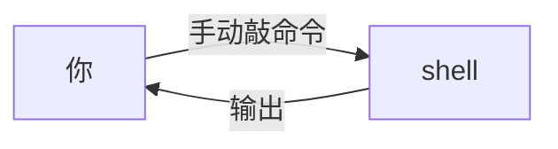
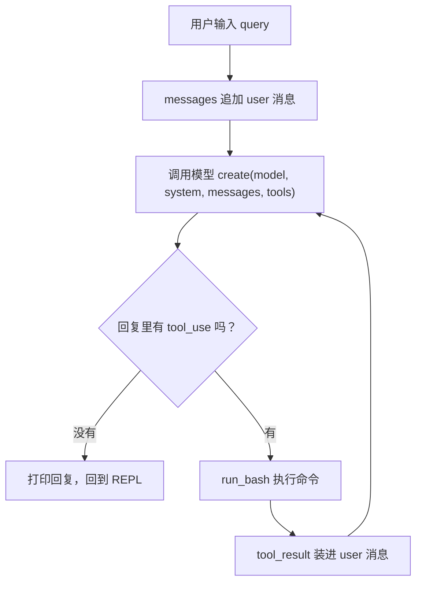

# 第 1 课总结 · 复习专用

> 用法：只看本文件，应该能完整回忆起这一课的数据与代码发展。

## 一、上节课（第 0 课 · 课前状态）的流程

第 0 课我们没有代码，只有人和终端：



伪代码：

```
无 Agent。
人想做什么 → 人自己敲命令 → 人自己看输出 → 人自己决定下一步
（模型顶多在旁边"给建议"，摸不到键盘）
```

## 二、这节课（第 1 课 · Agent Loop）的流程



伪代码：

```
messages = [user: query]
while True:
    response = 模型(system, messages, tools=[bash说明书])
    messages.append(assistant: response.content)
    单子 = [b for b in response.content if b.type == "tool_use"]
    if 空(单子): 结束
    for 每张单子:
        output = subprocess 执行 command（危险命令直接拒绝）
        results.append(tool_result: {tool_use_id, content=output})
    messages.append(user: results)
```

## 三、这节课在哪加了什么

| 位置 | 加了什么 |
|---|---|
| `mini_claude/llm.py`（全新） | 连接模型的脏活：`get_client()` 读 .env 造 Anthropic 客户端、`get_model()` 读模型 ID。导入与联网分离，测试可离线 |
| `mini_claude/loop.py`（全新，核心） | SYSTEM 岗位说明书；BASH_TOOL 工具说明书（JSON Schema）；run_bash（危险清单 + subprocess + 超时 + 5 万字截断）；agent_loop 四步循环：调模型→记录→挑单判停→执行回填 |
| `mini_claude/__main__.py`（全新） | REPL 前台：history 跨轮保留记忆、client 懒初始化 |
| `tests/fakes.py` + `test_lesson01_loop.py`（全新） | 假模型剧本（SimpleNamespace + FakeClient 记参数），四个离线剧本验证全绿 |

**借助的新库/新表**：第三方库只有 anthropic、python-dotenv（pytest 是测试工具）；**无任何数据库表、无文件写入**——本课 Agent 只通过 shell 读世界，还不落盘。

**一句话增量**：空仓库 → 一个"模型出嘴、程序出手"、模型自主决定停手的真 Agent。

## 四、自测三问（能脱稿回答就过关）

1. `tool_use` 和 `tool_result` 分别出现在哪种 role 的消息里？靠什么字段配对？（assistant / user，tool_use_id）
2. 循环靠什么判断该结束？这个决定权在谁手里？（回复里没有 tool_use 块；模型）
3. 多轮对话的"记忆"是哪来的？（history 列表完整保留、每次调用全量重发）
