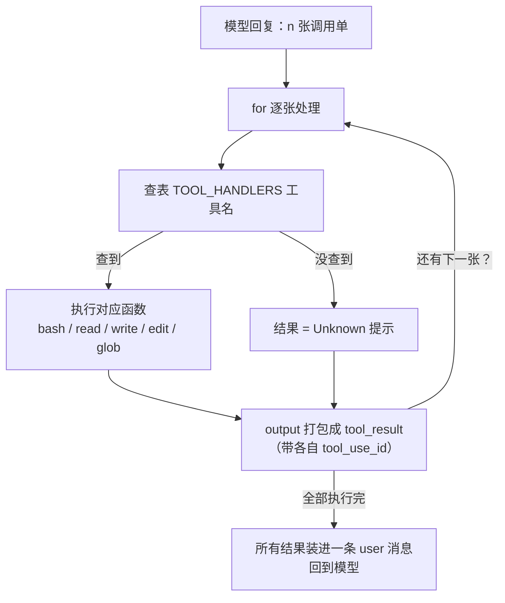

# 第 2 课主教案 · Tool Use：工具从 1 个变 5 个，循环只改一行

## 〇、开始前：把代码切到本课的状态

本课完成时的代码状态打了一个 git 标签 `lesson-02`，在仓库根目录执行：

```sh
git checkout lesson-02        # 切到本课刚完成时的状态（此刻你会看到本课的全部代码）
git checkout main             # 看完回来，main 永远指向最新进度
git diff lesson-01 lesson-02 -- mini_claude/ tests/   # 想直击增量？这条命令列出本课所有代码变化
```

小知识：`checkout 标签` 会进入 Git 说的"分离头指针"状态——别被名字吓到，它只是说"你在看历史快照，别在这儿盖新房子"。看代码完全没问题，`git checkout main` 随时回家。

## 课程信息卡

| 项 | 内容 |
|---|---|
| 课程编号 | 第 2 课 / 共 18 课 |
| 所属阶段 | 阶段一 · 让 Agent 动起来（第 1–4 课） |
| 本节目标 | 配齐五件套工具，把"硬编码执行"改成"查表分发" |
| 上节遗留问题 | 只有 bash 一把锤子：干任何事都要绕道 shell，慢、脆、而且模型必须精通 shell |
| 本节新增能力 | read_file / write_file / edit_file / glob 四个原生工具；一次回复执行多张调用单；未知工具的优雅兜底 |
| 涉及文件 | 新增 `mini_claude/tools.py`、`tests/test_lesson02_tools.py`；修改 `mini_claude/loop.py`、`tests/fakes.py`、`tests/test_lesson01_loop.py` |
| 环境与依赖 | 无新第三方库（pathlib/glob 全是标准库）；本课还会教你 monkeypatch 这个测试技巧 |
| 如何验证 | `.venv/bin/python -m pytest -q` 应见 13 passed |
| 读完你应该能说出 | ① 加一个新工具的三个步骤；② 一次两张调用单怎么跟结果配对；③ safe_path 挡的是什么 |
| 进度地图 | 阶段一 ▶ 1→[**2**]→3→4 ‖ 阶段二 5→…→8 ‖ 阶段三 9→…→12 ‖ 阶段四 13 ‖ 阶段五 14→15 ‖ 阶段六 16→17→18 |

---

## 一、定位

### 功能定位

上节课收尾时我们的 Agent 已经能干活了，但它是"一把锤子走天下"：想读文件？`cat`。想找文件？`ls`。这套路子能用，问题出在三处——每件事都要开子进程（慢）、命令语法跟着系统走（脆）、模型必须先精通 shell 才能干活（门槛高）。

本节课解决的就是这个能力缺口：**把"读、写、改、找"做成模型可以直接点名的原生工具**。做完之后，Agent 获得的新能力是——它不再需要知道 shell 就能操作文件，而且一次回复可以同时发出多张调用单并行干活。

### 代码定位

**空间位置**：新工具们住在新建的 `mini_claude/tools.py` 里，这是项目第一个"功能区"模块。它处于执行链的最下游——`agent_loop` 收到调用单后查 `TOOL_HANDLERS` 表，表把请求转给 tools.py 里的函数，函数去碰真实世界。上游是 loop.py（第 1 课就有），下游是磁盘和 shell。

**时间位置**：为什么现在才拆？因为第 1 课的使命是让你先看清循环本身的形状——如果第一天就把工具、分发、循环搅在一起，你会分不清哪部分是本质。现在循环你已经吃透了，把工具抽出去，你才能体会"**循环是常量，工具是变量**"这句话的分量。这也是原项目 s02 的标题含义："多加一个工具，只加一行"。

---

## 二、代码理解

本课的增量分三块：新文件 tools.py（五件套+分发表）、loop.py 的手术（改一行）、测试装备的升级。逐个看。

### 2.1 tools.py——五件套住进一个屋子

**第一件事：给文件工具配个保安 safe_path**

```python
WORKDIR = Path.cwd()
MAX_OUTPUT = 50000


def safe_path(p: str) -> Path:
    path = (WORKDIR / p).resolve()
    if not path.is_relative_to(WORKDIR):
        raise ValueError(f"Path escapes workspace: {p}")
    return path
```

解释：`WORKDIR` 在模块加载时记下"Agent 被启动在哪个目录"，之后所有文件工具都以它为家。`safe_path` 干的事用大白话说就是：把模型给的路径（可能是 `notes/a.txt` 这种相对路径）**拼到家的地址上再解析成绝对路径**，然后检查解析结果是不是还在家里面。为什么要 resolve？因为 `../` 这种相对跳级只有解析成绝对路径后才现形——模型写 `../../etc/passwd`，拼出来一 resolve，家没了，直接拒绝。这是文件工具的安全底线，第 3 课的门禁系统会跟它打配合。

**第二件事：bash 从 loop.py 搬过来**（原样搬家，那套危险清单、超时、截断都没动，这里不重复贴）。搬家本身就是本课的叙事：工具的归工具，循环的归循环。

**第三件事：四个新工具函数**。逐个看关键的点：

```python
def run_read(path: str, limit: int | None = None) -> str:
    try:
        lines = safe_path(path).read_text(encoding="utf-8").splitlines()
        if limit and limit < len(lines):
            lines = lines[:limit] + [f"... ({len(lines) - limit} more lines)"]
        return "\n".join(lines)
    except Exception as e:
        return f"Error: {e}"
```

`run_read`：按行读文本。`limit` 参数很贴心——模型经常只需要"前 20 行确认一下"，超出的部分不删掉而是换成一行提示"还有 N 行"，这样模型知道文件比它看到的大，需要时会再读。注意结尾的写法：**错误永远作为字符串返回，不抛异常**。为什么？这跟第 1 课讲过的是同一个道理——这些字符串最终会作为 tool_result 念给模型听，"文件不存在"对模型来说是正常的工作信息，不是程序事故。

```python
def run_write(path: str, content: str) -> str:
    try:
        file_path = safe_path(path)
        file_path.parent.mkdir(parents=True, exist_ok=True)
        file_path.write_text(content, encoding="utf-8")
        return f"Wrote {len(content)} bytes to {path}"
    except Exception as e:
        return f"Error: {e}"
```

`run_write`：整文件覆盖写。`mkdir(parents=True, exist_ok=True)` 是"一路建好父目录，已存在也不报错"——模型想写 `notes/2026/a.txt` 而目录不存在时，不会摔跟头。返回值 "Wrote N bytes" 是给模型的回执：写了多少，它心里有数。

```python
def run_edit(path: str, old_text: str, new_text: str) -> str:
    try:
        file_path = safe_path(path)
        text = file_path.read_text(encoding="utf-8")
        if old_text not in text:
            return f"Error: text not found in {path}"
        file_path.write_text(text.replace(old_text, new_text, 1), encoding="utf-8")
        return f"Edited {path}"
    except Exception as e:
        return f"Error: {e}"
```

`run_edit` 是五件套里最讲究的一个：**精确文本替换，而且只换第一处**（`replace(old, new, 1)` 里那个 1）。两个设计都是为模型着想：找不到 old_text 就报错不动手，防止模型在错的内容上瞎改；只换第一处，防止"全文替换"把不该动的地方一起改了。Claude Code 真实的 Edit 工具也是同样的脾气。

```python
def run_glob(pattern: str) -> str:
    import glob as g
    try:
        matches = sorted({
            match for match in g.glob(pattern, root_dir=WORKDIR, recursive=True)
            if (WORKDIR / match).resolve().is_relative_to(WORKDIR)
        })
        shown = matches[:200]
        if len(matches) > 200:
            shown.append("... (more matches omitted; narrow the pattern)")
        return "\n".join(shown) if shown else "(no matches)"
    except Exception as e:
        return f"Error: {e}"
```

`run_glob`：标准库 glob 负责匹配，`recursive=True` 让 `**` 能钻子目录，`root_dir=WORKDIR` 把搜索范围钉在家里。中间那个集合推导式做了两件事：去重、再把每条结果过一遍"是否还在工作区内"的检查（防御 `**` 加上诡异符号钻空子）。最多列 200 条——结果太多时宁可让模型换更精确的 pattern，也不能把几万行塞进上下文（这个"上下文金贵"的主题，第 8 课会正面强攻）。

**第四件事：说明书清单与分发表**

```python
TOOLS = [
    {"name": "bash", "description": "Run a shell command.", "input_schema": {...}},
    {"name": "read_file", ..., "input_schema": {..., "properties": {"path": ..., "limit": ...}, "required": ["path"]}},
    {"name": "write_file", ...},
    {"name": "edit_file", ...},
    {"name": "glob", ...},
]

TOOL_HANDLERS = {
    "bash": run_bash, "read_file": run_read, "write_file": run_write,
    "edit_file": run_edit, "glob": run_glob,
}
```

`TOOLS` 是给模型看的五份说明书（JSON Schema，第 1 课讲过的模子，多参数的写法看 read_file 那份：可选参数不进 required）。`TOOL_HANDLERS` 是给我们自己看的分发表——键是工具名，值是函数本身（Python 里函数是一等公民，可以像值一样塞进字典）。**注意这两个结构是平行存在的：TOOLS 决定模型"知道"什么，TOOL_HANDLERS 决定程序"会做"什么。**加新工具就是两个结构各登记一笔，仅此而已。

### 2.2 loop.py——手术台上的那一行

循环的骨架完全没动，变化只有两处。先看头部：

```python
from .tools import TOOLS, TOOL_HANDLERS, WORKDIR

SYSTEM = (
    f"You are a coding agent. Workspace: {WORKDIR}. "
    "Use the available tools to solve tasks. Act, don't explain."
)
```

原来的 BASH_TOOL 和 run_bash 从这个文件里消失了（搬家了），SYSTEM 从"用 bash 解决任务"改成"用可用的工具们解决任务"，并且把工作区路径告诉了模型——不然模型给 read_file 传相对路径时都不知道相对谁。再看执行工具的那几行：

```python
        results = []
        for block in tool_calls:
            print(f"\033[33m> {block.name}\033[0m")
            handler = TOOL_HANDLERS.get(block.name)
            output = handler(**block.input) if handler else f"Unknown: {block.name}"
            print(str(output)[:200])
            results.append({
                "type": "tool_result",
                "tool_use_id": block.id,
                "content": output,
            })
```

对比第 1 课的 `output = run_bash(block.input["command"])`：硬编码换成了查表。`handler(**block.input)` 这个写法值得停下来看一眼——`block.input` 是个字典（比如 `{"path": "a.txt", "limit": 5}`），两个星号把字典**拆开成关键字参数**喂给函数，正好对上 `run_read(path, limit)` 的签名。这就是为什么说明书里的 `input_schema` 参数名必须和执行函数的参数名一字不差：**模型照着说明书填单子，星号对着参数名拆包，两头一对，严丝合缝。**

还有个小兜底：`if handler else f"Unknown: {block.name}"`——万一模型点了不存在的工具名（模型偶尔会做梦），程序不崩溃，而是把 "Unknown: xxx" 作为结果交回去，模型看到就知道换别的路。这种"把错误当信息喂回模型"的风格，你从第 1 课的危险命令拦截就该有印象了，它会贯穿整个课程。

另外注意打印从 `$ 命令` 换成了 `> 工具名`——因为现在执行的不只是命令了。

### 2.3 测试装备升级：一次多张单子怎么测

`tests/fakes.py` 里的剧本工厂升级了：原来 `tool_response` 只会造 bash 单，现在拆出 `tool_block(name, arguments, id)` 通用单据，`tool_response` 变成"一张单子版"的便捷封装。于是我们可以构造"一条回复夹两张单子"的剧本。`tests/test_lesson02_tools.py` 里最核心的一个测试：

```python
def test_one_response_many_tool_calls():
    two_calls = SimpleNamespace(content=[
        tool_block("bash", {"command": "echo hi-agent"}, "tool-1"),
        tool_block("glob", {"pattern": "mini_claude/*.py"}, "tool-2"),
    ])
    client = FakeClient([two_calls, text_response("找到了。")])
    messages = [{"role": "user", "content": "看看有哪些 py 文件"}]

    agent_loop(messages, client, "fake-model")

    results = messages[2]["content"]
    assert [r["tool_use_id"] for r in results] == ["tool-1", "tool-2"]
    assert results[0]["content"] == "hi-agent"
    assert "mini_claude/loop.py" in results[1]["content"]
```

它验证了三件事：两张单子都被执行了（不只是第一张）、每张单子的结果用自己的 id 配对（不会张冠李戴）、两个结果装在**同一条** user 消息里交回去。顺带一提，测试里到处出现的 `monkeypatch.setattr(tools, "WORKDIR", tmp_path)` 是 pytest 的一个标准把戏：**临时把模块变量换成测试专用的临时目录**，测试结束时自动还原——这样测试既能在干净的沙盒里读写文件，又不会污染你的真实仓库。这个技巧以后每课都用，认识一下。

另外，第 1 课的测试文件也动了两处：`run_bash` 的 import 改从 `mini_claude.tools` 来（搬家了嘛），剧本调用改成新签名。**测试跟着代码搬家是正常演化，不是推翻重写**——你看 git diff 时会看到就那么几行。

---

## 三、运行时辅助理解

示例输入：

> 用户：「看看 mini_claude 目录有哪些 .py 文件，并数数 loop.py 有多少行」

模型这次学聪明了：glob 和 wc 两件事互不依赖，**一次回复同时出两张单子**。真实运行（假模型剧本驱动真循环真工具）：

终端先打印：

```
> glob
mini_claude/__init__.py
mini_claude/__main__.py
mini_claude/llm.py
mini_claude/loop.py
mini_claude/tools.py
> bash
52 mini_claude/loop.py
```

messages 列表的最终形态（5 条，模型被调用 2 次）：

| # | role | 内容 |
|---|---|---|
| 0 | user | '看看 mini_claude 目录有哪些 .py 文件，并数数 loop.py 有多少行' |
| 1 | assistant | tool_use ×2：`glob(pattern="mini_claude/*.py")` id=call-001；`bash(command="wc -l mini_claude/loop.py")` id=call-002 |
| 2 | user | tool_result ×2：call-001 → 五个文件名；call-002 → '52 mini_claude/loop.py' |
| 3 | assistant | text: 'mini_claude 下有 5 个 .py 文件，loop.py 共 52 行。' |

注意第 1 条和第 2 条消息：**两张单子和两个结果都各自挤在同一条消息里**，靠 id 配对——这就是协议说的"多个 tool_use 对应多个 tool_result"。还要注意：本课开始，磁盘真的被 Agent 改变过了（write/edit 测试写了文件；真实使用中模型可以创建、修改你的代码文件）——Agent 从"读世界"进化到"改世界"，这也是下一课权限系统变得要紧的原因。

自己跑：`.venv/bin/python -m pytest tests/test_lesson02_tools.py -v` 逐个看绿；真实体验 `python -m mini_claude` 后输入「在 tmp 目录建一个 hello.txt 写上 hi 再读出来」，看它用 write_file 和 read_file 而不是 echo 重定向。

---

## 四、流程图理解



图后导读：模型的回复里带着几张调用单，循环就一丝不苟地跑几圈"查表→执行（或兜底 Unknown）→打包结果"的小循环，每张单子产出一条带着自己 id 的 tool_result，等所有单子处理完，n 条结果一起塞进一条 user 消息回到模型——图上 B→C→F→B 这条内圈是本课新增的"逐张处理"，而外圈的"回模型再评一轮"跟第 1 课一模一样。对照代码看：内圈就是 agent_loop 里那个 `for block in tool_calls`，外圈还是那个 `while True`；今天这一课我们只是在循环体内、原来写死 run_bash 的位置，接上了一张会生长的表。

---

## 五、环境与依赖

本课**零新第三方依赖**——pathlib、glob 都是 Python 自带的，装好的环境不用动。但有两个"软依赖"值得记一笔：

- **pytest 的 monkeypatch fixture**（第 2.3 节提过）：不是新装的包，是 pytest 自带的能力，用法 `monkeypatch.setattr(目标, "名字", 假值)`，测完自动还原。验证方式：随便跑一个带 tmp_path 的测试看它绿。常见错误：patch 错了对象（比如 patch 了 `tools.WORKDIR` 却在别的模块里直接 import 了值——我们后面课程会刻意用"模块属性访问"的写法避免这个坑，第 3 课你会看到）。
- **git 标签工作流**（本课教案开头的"切到本课"）：`git tag lesson-02` 打标签、`git checkout lesson-02` 切换、`git diff lesson-01 lesson-02` 看增量。这是本项目"每课一个快照"的基础设施，以后每课老师都会打好标签推上去。常见错误：在 detached HEAD 状态下直接改代码提交（会被主线丢弃）——看历史请 checkout 标签，写代码请回 main。

---

## 六、本节进度地图与下一课预告

**当前进度**：阶段一 ▶ 1→[**2**]→3→4 ‖ 阶段二 5→…→8 ‖ 阶段三 9→…→12 ‖ 阶段四 13 ‖ 阶段五 14→15 ‖ 阶段六 16→17→18

**下一课预告（第 3 课 · Permission）**：今天模型拿到了改写磁盘的权力，问题也跟着来了——它要是一时糊涂想写 `/etc/passwd`，或者想跑 `rm -rf /` 呢？下节课我们在"模型出单"和"真的执行"之间装一道**三道闸**：死名单直接拒、可疑操作按规则识别、拿不准的弹出来问你 y/N。你会看到循环里只加一个 if，但 Agent 从此有了"刹车"。

原项目对照阅读（补充材料）：`learn-claude-code/s02_tool_use/README.zh.md`。
