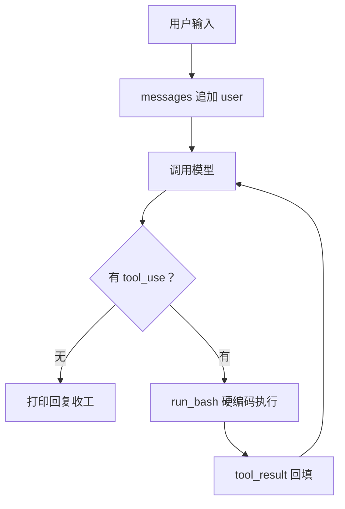
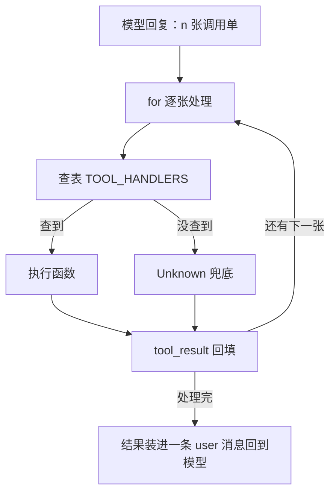

# 第 2 课总结 · 复习专用

## 一、上节课（第 1 课 · Agent Loop）的流程



伪代码：

```
messages = [user: query]
while True:
    response = 模型(system, messages, tools=[bash])
    messages.append(assistant)
    单子 = 挑出 tool_use 块
    if 空: 结束
    for 每张单子:
        output = run_bash(单子.input.command)   # 写死只认 bash
        results.append(tool_result)
    messages.append(user: results)
```

## 二、这节课（第 2 课 · Tool Use）的流程



伪代码：

```
TOOL_HANDLERS = { bash: run_bash, read_file: run_read, write_file: run_write,
                  edit_file: run_edit, glob: run_glob }
while True:
    ...同上...
    for 每张单子:
        handler = TOOL_HANDLERS.get(单子.name)
        output = handler(**单子.input) if handler else "Unknown: 名字"
        results.append(tool_result: {单子.id, output})
    messages.append(user: results)
```

## 三、这节课在上节基础上加了什么

| 位置 | 加了什么 |
|---|---|
| `mini_claude/tools.py`（全新） | safe_path 越界守卫；run_bash 从 loop 搬来；run_read（limit 截断）/run_write（自动建父目录）/run_edit（只换第一处）/run_glob（** 递归、限 200 条）四个新工具；TOOLS 五份说明书；TOOL_HANDLERS 分发表 |
| `mini_claude/loop.py` | 硬编码 `run_bash(...)` → 查表 `TOOL_HANDLERS[block.name](**block.input)`，附 Unknown 兜底；SYSTEM 改为告知工作区路径与多工具 |
| `tests/fakes.py` | 剧本工厂支持任意工具（tool_block 拆出），可构造一次多张调用单 |
| `tests/test_lesson02_tools.py`（全新） | 工具行为 8 项 + 分发/多单/未知工具/系统提示词 4 项 |

**借助的新库/新表**：零新第三方库（pathlib/glob/re 均为标准库）；无数据库表；但磁盘从此可被 Agent 真实写入（write/edit）。测试新装备：pytest 的 tmp_path 与 monkeypatch。

**一句话增量**：一把锤子 → 五件套工具箱 + 查表分发；循环骨架一行未改，只换了"执行工具"那一行。

## 四、自测三问

1. 加一个新工具要动哪几处？（tools.py 写函数+写说明书+登分发表；循环零改动）
2. 一次回复两张单子，结果怎么配对？（各带 tool_use_id，全部装进同一条 user 消息）
3. `handler(**block.input)` 里的 `**` 在干嘛？（把字典按键名拆成关键字参数，依赖说明书参数名与函数签名一致）
