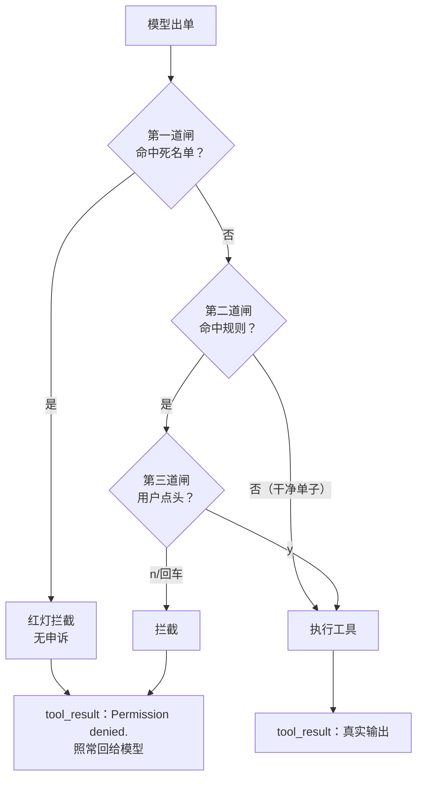

# 第 3 课主教案 · Permission：执行前的三道闸

## 〇、开始前：把代码切到本课的状态

本课完成时的代码状态打了 git 标签 `lesson-03`：

```sh
git checkout lesson-03        # 切到本课刚完成时的状态
git checkout main             # 看完回主线
git diff lesson-02 lesson-03 -- mini_claude/ tests/   # 本课相对上节的全部增量
```

## 课程信息卡

| 项 | 内容 |
|---|---|
| 课程编号 | 第 3 课 / 共 18 课 |
| 所属阶段 | 阶段一 · 让 Agent 动起来（第 1–4 课） |
| 本节目标 | 在"模型出单"和"真的执行"之间装上三道闸：死名单 → 规则 → 用户确认 |
| 上节遗留问题 | Agent 拿到了写磁盘的权力，却没有任何拦截机制：模型想写 /etc/passwd 就真的写了 |
| 本节新增能力 | 危险命令硬拒绝、越界/破坏性操作按规则识别、可疑操作弹给用户 y/N 确认；被拒原因回传模型 |
| 涉及文件 | 新增 `mini_claude/permission.py`、`tests/test_lesson03_permission.py`；修改 `mini_claude/loop.py`、`mini_claude/tools.py`、`tests/test_lesson01_loop.py` |
| 环境与依赖 | 无新第三方库（re 是标准库） |
| 如何验证 | `.venv/bin/python -m pytest -q` 应见 23 passed；真实运行时输入"删掉 xx.txt"体验第三道闸 |
| 读完你应该能说出 | ① 三道闸各自负责什么、顺序为什么不能乱；② 拦截为什么用"回话"而不是抛异常；③ 正则怎么区分"rm 命令"和"firm 单词" |
| 进度地图 | 阶段一 ▶ 1→2→[**3**]→4 ‖ 阶段二 5→…→8 ‖ 阶段三 9→…→12 ‖ 阶段四 13 ‖ 阶段五 14→15 ‖ 阶段六 16→17→18 |

---

## 一、定位

### 功能定位

上节课结束时，我们的 Agent 五件套在手，能读能写能改——但也意味着**模型说的任何一句"帮我执行"都会被照办**。这是项目演化到本阶段暴露出的最大缺口：能力上来了，控制力为零。

本节课解决它。加入三道闸之后，项目获得的新能力是：无论模型出什么单，**真正落地的都是"经过审查的操作"**。而且请注意一个设计立场：审查不等于窒息——绝大多数正常操作一路绿灯，只有真正危险的才被留下来。

### 代码定位

**空间位置**：新文件 `permission.py` 处于执行链的关键窄口上——上游是 loop.py 挑出的每一张调用单，下游才是分发表和工具函数。它不在循环外面当摆设，而是**卡在主路上**：每张单子必须先过它。跟 tools.py 的关系也有讲究：permission.py 通过 `from . import tools` 引用工具模块的工作区路径（做越界判断），但它反过来不碰任何工具函数——权限层只知道"放行还是拦下"，不知道"放行之后会发生什么"。

**时间位置**：为什么不在第 1 课就装？两个原因。一是那时 Agent 只有一个 bash 且我们还谈不上信任模型的问题——**先把主干道修通，才知道闸门该卡在哪个位置**；二是第 1 课的 run_bash 里其实埋了个粗糙的保命清单，那是个占位符——本课它"转正"了：死名单从工具内部搬到独立的权限层，run_bash 从此只管执行、不管判断（看 git diff 里 tools.py 那几行被删掉的代码）。判断权上收、执行权下沉，这是架构往清晰方向走的一步。

---

## 二、代码理解

本课增量：一个新文件 permission.py（三道闸），loop.py 加一个 if，tools.py 删掉旧保命清单。逐段读。

### 2.1 第一道闸：死名单

```python
DENY_LIST = ["rm -rf /", "sudo", "shutdown", "reboot", "mkfs", "dd if=", "> /dev/sda"]


def check_deny_list(command: str) -> str | None:
    for pattern in DENY_LIST:
        if pattern in command:
            return f"Blocked: '{pattern}' is on the deny list"
    return None
```

死名单是最粗也最快的一道闸：命令字符串里**包含**任何一个模式，就地拦截。它的特点是"没有申诉通道"——不问你、不看上下文，`sudo ls` 里的 `sudo` 命中名单就是拦。你会注意到函数的返回值设计：命中返回**拒绝理由字符串**，安全返回 **None**。为什么不返回 True/False？因为拒绝理由是留给后面用的——要打印给用户看，第 4 课还会让它原样回传。这个"返回理由或 None"的形状，三道闸会保持一致。

### 2.2 第二道闸：规则匹配（本课最烧脑的三行）

```python
DESTRUCTIVE_COMMAND_WORD = re.compile(
    r"(?i)(?:^|[;&|()\n])\s*(?:rm|del)(?=\s|$|[;&|()])"
)


def contains_destructive_command(command: str) -> bool:
    return bool(DESTRUCTIVE_COMMAND_WORD.search(command))
```

先说这东西防的是什么坑：判断"命令里有 rm"太容易误伤——`echo firm` 里有 "rm"，`mkdir arm` 里也有 "rm"，人家是良民。所以真正的判断标准是：**rm（或 del）是不是作为一条独立的命令词出现**——要么在命令开头，要么跟在分号、管道符、换行这些"命令分隔符"后面；并且后面跟的是空格或命令结尾。

这个正则拆开来其实就四小块，我们逐个符号看：

- `(?i)`：大小写不敏感（RM、Rm 也算）；
- `(?:^|[;&|()\n])`：rm 的**左边**，要么是字符串开头 `^`，要么是这些命令分隔符之一；
- `\s*`：中间可以隔着任意空白；
- `(?:rm|del)`：主角登场，rm 或 del 两个词；
- `(?=\s|$|[;&|()])`：rm 的**右边**，必须是空格、结尾或分隔符——这个 `(?=...)` 叫"前瞻"，意思是"往右边看一眼，是这个样子才算数，但不要把它算进匹配内容"。

看不懂每个符号没关系，你只需要带走两个认识：第一，**正则是"描述长相"的语言，这段说的是'rm 得像个命令，不像个单词'**；第二，这种精细判断为什么值得？测试里那四行断言就是答案——`rm old.txt` 算、`ls; rm old.txt` 算、`echo firm` 不算、`echo rm` 不算。

规则表是第二道闸的主体：

```python
PERMISSION_RULES = [
    {"tools": ["read_file", "write_file", "edit_file"],
     "check": lambda args: not (tools.WORKDIR / args.get("path", "")).resolve().is_relative_to(tools.WORKDIR),
     "message": "Writing outside workspace"},
    {"tools": ["bash"],
     "check": lambda args: contains_destructive_command(args.get("command", "")) or
                any(kw in args.get("command", "") for kw in ["rm ", "> /etc/", "chmod 777"]),
     "message": "Potentially destructive command"},
]


def check_rules(tool_name: str, args: dict) -> str | None:
    for rule in PERMISSION_RULES:
        if tool_name in rule["tools"] and rule["check"](args):
            return rule["message"]
    return None
```

每条规则三样东西：管哪些工具（tools）、怎么判断可疑（check 是个小函数）、可疑时说什么（message）。第一条规则管三个文件工具：路径 resolve 之后不在工作区内就算可疑——是不是跟第 2 课的 safe_path 很像？分工不一样：safe_path 是工具自己的保安（越界直接报错），这条规则是门卫（越界了先记下来，送到第三道闸问你"要不要放行"）。**同一个判断出现在两层，是刻意的纵深防御**：万一你点了 y，真写的时候 safe_path 还会再拦一次。

顺带解释 `lambda args: ...`：lambda 就是一次性小函数，"给我参数字典，我返回是/否"。规则用 lambda 写是为了让表保持紧凑——判断逻辑一眼一行。

还有个值得留意的细节：这里判断路径用的是 `tools.WORKDIR`（模块名点属性），而不是 `from .tools import WORKDIR` 把值复制过来。为什么？**如果复制值，测试时把 tools.WORKDIR 换成临时目录，permission.py 里的这份还是旧地址**；用"模块.属性"的写法，改的是同一个源头。这是第 2 课埋的那个"patch 错对象"的坑的官方解法。

### 2.3 第三道闸：把决定权交还给人

```python
def ask_user(tool_name: str, args: dict, reason: str) -> str:
    print(f"\n\033[33m[permission] {reason}\033[0m")
    print(f"   Tool: {tool_name}({args})")
    choice = input("   Allow? [y/N] ").strip().lower()
    return "allow" if choice in ("y", "yes") else "deny"
```

打印黄色警告、列出完整参数、等你在键盘上敲 y 或 n。注意提示词写的 `[y/N]`——大写 N 是 Unix 的行话，意思是"**直接回车等于 N**"。这不是随手写法，是安全设计：默认答案必须落在安全的一侧，手滑回车不能变成放行。

### 2.4 三道闸串联 + 循环里只加一个 if

```python
def check_permission(block) -> bool:
    if block.name == "bash":
        reason = check_deny_list(block.input.get("command", ""))
        if reason:
            print(f"\n\033[31m[blocked] {reason}\033[0m")
            return False
    reason = check_rules(block.name, block.input)
    if reason:
        if ask_user(block.name, block.input, reason) == "deny":
            return False
    return True
```

顺序有讲究：**死名单最便宜、最确定，先跑**——`rm -rf /` 根本不值得浪费用户一次确认；**规则其次**；**问人最贵（要打断你的工作），放最后**。便宜的检查挡在最前面，这是所有过滤器流水线的通用排序法。还要注意：死名单只对 bash 有意义（文件工具没有"命令"），所以外面套了个 `if block.name == "bash"`。

然后是 loop.py 的手术——完整贴出变化的部分：

```python
from .permission import check_permission
from .tools import TOOLS, TOOL_HANDLERS, WORKDIR

SYSTEM = (
    f"You are a coding agent. Workspace: {WORKDIR}. "
    "Use the available tools to solve tasks. Act, don't explain. "
    "All destructive operations require user approval."
)

        ...（中间不变）...

        results = []
        for block in tool_calls:
            print(f"\033[36m> {block.name}\033[0m")
            if not check_permission(block):
                results.append({
                    "type": "tool_result",
                    "tool_use_id": block.id,
                    "content": "Permission denied.",
                })
                continue
            handler = TOOL_HANDLERS.get(block.name)
            output = handler(**block.input) if handler else f"Unknown: {block.name}"
            ...
```

循环里确实只加了一个 if（原项目 s03 的自评也是这句话）。但请品味被拒之后那几行：我们没有 `break`、没有 `sys.exit`，而是**把 "Permission denied." 打包成 tool_result，跟正常结果一样交回给模型**。为什么？回忆预习里的问题——模型是司机，被拦下的正确反应是换条路继续开，而不是熄火。模型收到拒绝话术，自然会试别的办法（试试更温和的命令，或者跟用户解释）。**拦截不是对抗模型，而是给模型的反馈**——这个立场在下一课会再次深化。

顺带：SYSTEM 末尾加了"All destructive operations require user approval"——让模型提前知道这个世界的规矩，它会更少鲁莽，被拦次数更少。缰绳不仅在手上，也要让马知道缰绳在。

### 2.5 tools.py 的一处减法

```python
def run_bash(command: str) -> str:
    """执行 shell 命令。危险命令的拦截自第 3 课起由权限系统负责。"""
    try:
        r = subprocess.run(command, shell=True, cwd=WORKDIR, ...)
```

对比第 2 课：开头的 `dangerous` 清单和检查没了。**删代码也是演化的一部分**：拦截职责上收到权限层后，工具层回归"纯执行"，一个判断都不做。第 1 课的两个测试随之搬家：`test_run_bash_direct` 里"rm -rf / 被拦"的断言删掉了（职责不在了），循环层的拦截测试改断 "Permission denied."（新的统一话术）。`git diff` 里能看到这几行搬家轨迹。

---

## 三、运行时辅助理解

示例输入（就选个刺头的）：

> 用户：「把 old.txt 删了；不行就把根目录全删了」

假设工作区里有 old.txt（内容"珍贵数据"）。模型连出两招，真实运行记录（假模型剧本 + 真闸门，键盘模拟敲 n）：

终端输出：

```
> bash

[permission] Potentially destructive command
   Tool: bash({'command': 'rm old.txt'})
   Allow? [y/N] n
> bash

[blocked] Blocked: 'rm -rf /' is on the deny list
```

messages 演化与三道闸的走位：

| # | 发生什么 | 走到哪道闸 |
|---|---|---|
| 0 | user 输入 | — |
| 1 | 模型出单 `bash("rm old.txt")` | — |
| 2 | 第一道闸：不含死名单词，放行 → 第二道闸：`rm` 是命令词，命中规则 → 第三道闸：问你，敲 n | 一→二→三 |
| 3 | tool_result "Permission denied." 回填 | — |
| 4 | 模型不服，换招 `bash("rm -rf /")` | — |
| 5 | 第一道闸：命中死名单，**红灯直接拦，第三道闸都没走** | 一 |
| 6 | tool_result "Permission denied." 回填，模型认怂总结收工 | — |

事后检查：`old.txt` 还在，内容完好。两个观察值得回味：第一，`rm old.txt` 走满了三道闸而 `rm -rf /` 只走了一道——**越危险的检查路径越短**；第二，模型被拒后会自己调整策略（这里它升级了破坏力度，被死名单兜住了；真实场景里它更多会换温和方案或向你解释）。

自己跑：`.venv/bin/python -m pytest tests/test_lesson03_permission.py -v`；真实体验配好 key 后输入「帮我把 xxx 文件删掉」，亲身体验第三道闸停下来等你敲键的那一刻。

---

## 四、流程图理解



图后导读：一张调用单从左到右要连过三道闸，三道闸的脾气完全不同——第一道只查名单、命中即拒、连问都不问；第二道只负责"标记可疑"，它自己不拦人，而是把可疑单子推给第三道；第三道是唯一会停下来的地方，用户点头才放行。而无论走哪条路被拦下，殊途同归都汇入 F：拒绝话术作为 tool_result 回给模型——所以对模型而言，被拦和得到一个错误输出没有本质区别，循环继续转。对照代码：B 就是 `check_deny_list`，C 就是 `check_rules`，D 就是 `ask_user`，E 之后才轮到第 2 课的查表分发；E 那条绿路上没有任何新代码——这正是本课的克制之处，闸门只拦，不添堵。

---

## 五、环境与依赖

本课依旧零新第三方依赖，但有两个知识点值得登记：

- **re 标准库**（正则）：Python 自带，`re.compile` 把表达式预编译成可反复使用的匹配器。想深入的话，[官方 howto](https://docs.python.org/3/howto/regex.html) 是最好的起点；本课用到的只是"字符类、分组、前瞻"三样。验证方式：跑 `test_destructive_command_word_regex` 看绿。常见错误：忘记原始字符串前缀 r——`"\n"` 是换行符而 `r"\n"` 是两个字符，正则里两者天差地别。
- **测试里的"假用户"**：第三道闸要等键盘输入，测试没法真等人，所以用 `monkeypatch.setattr("builtins.input", lambda *a: "n")` 把 input 换成永远回答 n 的假货；测放行时换成 "y"。这招比第 2 课 patch 模块变量更进一步——**patch 的是 Python 内置函数**，因为 `input` 是全局的名字，所以 patch 目标写成 `"builtins.input"`。常见错误：只 patch 了 permission 模块里的某个名字，结果 ask_user 内部用的还是真 input，测试卡住等人敲键盘（pytest 会一直挂起，遇到测试不动八成是这个）。

---

## 六、本节进度地图与下一课预告

**当前进度**：阶段一 ▶ 1→2→[**3**]→4 ‖ 阶段二 5→…→8 ‖ 阶段三 9→…→12 ‖ 阶段四 13 ‖ 阶段五 14→15 ‖ 阶段六 16→17→18

**下一课预告（第 4 课 · Hooks）**：注意到没有？权限检查现在焊死在循环体内。要是明天想加"每次调用工具都记日志""输出太大就告警"，是不是还得继续往循环里塞 if？循环会越养越肥。下节课我们给循环装上**钩子**——在固定位置预留"挂点"，权限、日志、告警全部改造成挂上去的插件。你将看到权限检查从循环里"搬家"，而循环变得比第 1 课还干净。

原项目对照阅读（补充材料）：`learn-claude-code/s03_permission/README.zh.md`。
