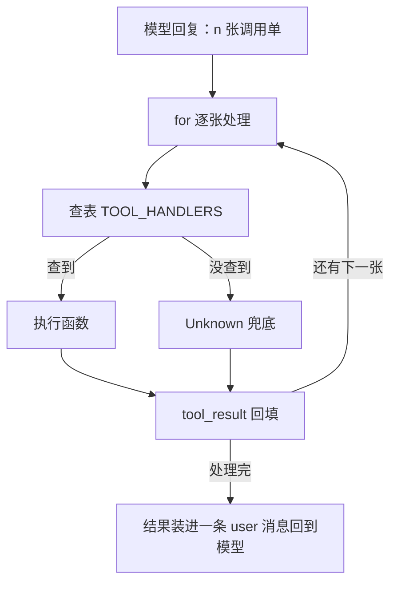
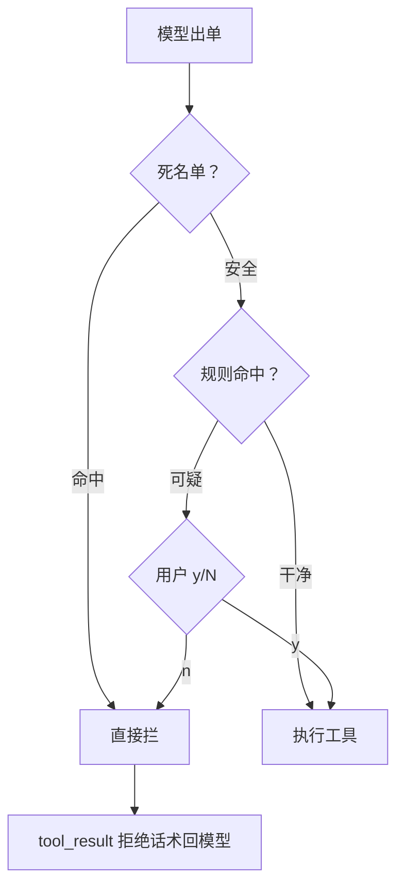

# 第 3 课总结 · 复习专用

## 一、上节课（第 2 课 · Tool Use）的流程



伪代码：

```
for 每张单子:
    handler = TOOL_HANDLERS.get(单子.name)
    output = handler(**单子.input) if handler else "Unknown"
    results.append(tool_result)
messages.append(user: results)
```

## 二、这节课（第 3 课 · Permission）的流程



伪代码：

```
def check_permission(block):
    if bash 且 check_deny_list(command): 红灯打印, return False   # 闸1
    if check_rules(name, input):                                  # 闸2
        if ask_user(...) == "deny": return False                  # 闸3
    return True

# 循环里只加：
if not check_permission(单子):
    results.append(tool_result: "Permission denied."); continue
```

## 三、这节课在上节基础上加了什么

| 位置 | 加了什么 |
|---|---|
| `mini_claude/permission.py`（全新） | 闸1 DENY_LIST+check_deny_list；闸2 正则 DESTRUCTIVE_COMMAND_WORD + PERMISSION_RULES（路径越界/破坏命令）+check_rules；闸3 ask_user（默认拒）；check_permission 串联 |
| `mini_claude/loop.py` | 执行前插入 `if not check_permission(block)`，被拒以 "Permission denied." 回填；SYSTEM 增加"破坏性操作需用户批准" |
| `mini_claude/tools.py` | run_bash 删掉第 1 课的内置危险清单（职责上收到权限层） |
| `tests/` | 第 1 课两处断言随职责搬家；新增第 3 课 10 项（含假用户、拒绝后文件完好的实证） |

**借助的新库/新表**：零新第三方库（re 为标准库）；无数据库表；无新文件落盘。新测试手法：patch builtins.input 模拟用户敲键。

**一句话增量**：调用单执行前多了三道闸——便宜的先挡、可疑的问人、拒绝的回话；循环只加一个 if。

## 四、自测三问

1. 三道闸为什么是这个顺序？（便宜的先跑：死名单最便宜最确定，问人最贵放最后）
2. `echo firm` 里的 "rm" 为什么没被误伤？（正则要求 rm 是命令词：左边是开头或分隔符，右边是空白/结尾）
3. 被拦后程序为什么不崩？（拒绝话术作为 tool_result 回给模型，循环继续，模型自己换路）
