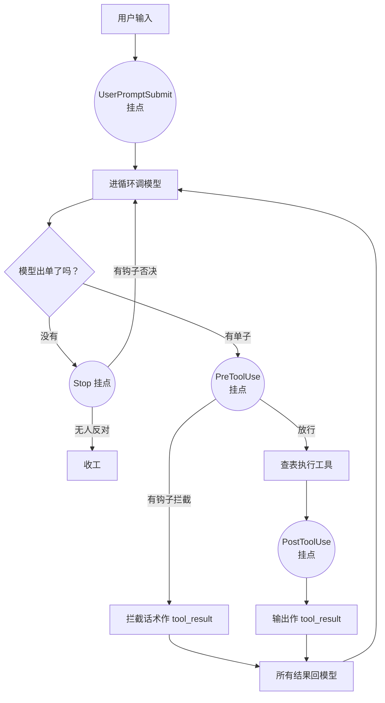

# 第 4 课主教案 · Hooks：挂在循环上，不写进循环里

## 〇、开始前：把代码切到本课的状态

本课完成时的代码状态打了 git 标签 `lesson-04`：

```sh
git checkout lesson-04        # 切到本课刚完成时的状态
git checkout main             # 看完回主线
git diff lesson-03 lesson-04 -- mini_claude/ tests/   # 本课相对上节的全部增量
```

## 课程信息卡

| 项 | 内容 |
|---|---|
| 课程编号 | 第 4 课 / 共 18 课 |
| 所属阶段 | 阶段一 · 让 Agent 动起来（第 1–4 课），本课是阶段一的收官 |
| 本节目标 | 给循环装四个扩展点，把权限检查改造成 PreToolUse 钩子 |
| 上节遗留问题 | 权限检查焊在循环体内：以后每加一种"循环前后该做的事"都要动 agent_loop，核心循环会越来越肥 |
| 本节新增能力 | UserPromptSubmit / PreToolUse / PostToolUse / Stop 四个扩展点；出厂自带日志、大输出告警、会话统计钩子；Stop 钩子可否决收工 |
| 涉及文件 | 新增 `mini_claude/hooks.py`、`tests/test_lesson04_hooks.py`；修改 `mini_claude/loop.py`、`mini_claude/__main__.py`、`tests/test_lesson01_loop.py`、`tests/test_lesson03_permission.py` |
| 环境与依赖 | 无新第三方库 |
| 如何验证 | `.venv/bin/python -m pytest -q` 应见 29 passed |
| 读完你应该能说出 | ① 四个挂点各在什么时刻、哪个有权"管事"；② "第一个非 None 说了算"怎么运作；③ Stop 钩子怎么把模型拉回来 |
| 进度地图 | 阶段一 ▶ 1→2→3→[**4**] ✅ ‖ 阶段二 5→…→8 ‖ 阶段三 9→…→12 ‖ 阶段四 13 ‖ 阶段五 14→15 ‖ 阶段六 16→17→18 |

---

## 一、定位

### 功能定位

上节课给循环加了一个 `if not check_permission(block)`——功能成立，但开了一个危险的先例：**扩展逻辑长在了核心循环体内**。这次是权限，下次是日志、告警、审计……每个新需求都要修改 agent_loop，而 agent_loop 是全项目最不能随便动的文件。

本节课解决它：把循环里所有"到某时刻该做的杂事"抽成钩子。做完之后，项目获得的新能力是——**循环的行为可以在完全不修改循环代码的前提下被扩展**。你以后会反复看到这句话的兑现：第 5 课往 UserPromptSubmit 前后挂计划注入，第 8 课在 LLM 调用前挂压缩管线，第 9 课在会话结束挂记忆提取——它们全都不用再动 loop.py 一行。

### 代码定位

**空间位置**：新文件 `hooks.py` 是"事件的接线板"。它两头的位置都很微妙：对上，`loop.py` 现在只 import 一个 `trigger_hooks`，不再认识 permission；对下，`hooks.py` 的 `permission_hook` 反过来引用 permission.py 的三道闸。也就是说权限的**规则**没动（还在 permission.py），动的只是它的**接法**——从"循环直接调"改成"循环喊钩子、钩子调规则"。这个区分（规则 vs 接法）是本课最值得体会的一刀。

**时间位置**：为什么放在阶段一最后？因为钩子是"架构味道"最浓的一课，它需要你已经见过两种往循环里加东西的方式（第 2 课的工具、第 3 课的闸门），才能体会"第三种方式"好在哪里。原项目 s04 的 motto 说得精准："Hook around the loop, never rewrite the loop"——挂上去，别改写它。另外注意 Stop 钩子这个"否决收工"的能力，它是给未来留的种子：第 12 课的定时投递、第 17 课的目标判停，走的全是这条路。

---

## 二、代码理解

本课增量：新文件 hooks.py（挂点 + 出厂钩子），loop.py 的三处改造，__main__.py 的一行。逐段读。

### 2.1 挂点与接线板：HOOKS、register_hook、trigger_hooks

```python
HOOKS = {"UserPromptSubmit": [], "PreToolUse": [], "PostToolUse": [], "Stop": []}


def register_hook(event: str, callback) -> None:
    HOOKS[event].append(callback)


def trigger_hooks(event: str, *args):
    for callback in HOOKS[event]:
        result = callback(*args)
        if result is not None:
            return result
    return None
```

三小段，全部逻辑就这么多。`HOOKS` 是个字典：键是四个事件名，值是**函数列表**——每个挂点上可以挂任意多个钩子，按挂的顺序排队。`register_hook` 就是往列表尾巴上 append。`trigger_hooks` 是全场主角：`*args` 表示"参数形状由事件自己定"（PreToolUse 传一张调用单，PostToolUse 传单子加输出，Stop 传整个聊天记录），循环不用关心钩子要什么。循环逐个调用，**谁第一个返回了非 None，循环就把谁的返回值带回去，后面排队的连出场机会都没有**。

这个"非 None 说了算"的约定值得多想一层：它让钩子分成两种性格——"旁观者"（打印日志、记流水账，永远 return None）和"管理者"（权限检查，可拦；Stop 统计，可否决）。两种钩子写法和挂法完全一样，唯一的区别是返回值。约定简单到不需要文档，这就是好约定的样子。

### 2.2 权限检查搬家：permission_hook

```python
def permission_hook(block):
    """PreToolUse：第 3 课的三道闸搬到这里（规则本身仍在 permission.py，不复制）。"""
    if block.name == "bash":
        reason = permission.check_deny_list(block.input.get("command", ""))
        if reason:
            print(f"\n\033[31m[blocked] {reason}\033[0m")
            return reason
    reason = permission.check_rules(block.name, block.input)
    if reason:
        print(f"\n\033[33m[permission] {reason}\033[0m")
        print(f"   Tool: {block.name}({block.input})")
        choice = input("   Allow? [y/N] ").strip().lower()
        if choice not in ("y", "yes"):
            return "Permission denied by user"
    return None
```

逻辑跟第 3 课的 `check_permission` 一模一样——死名单、规则、确认，一步没少。变化有两个。第一，**函数形状变了**：从"返回 True/False 的裁判"变成"返回拦截原因或 None 的钩子"——钩子世界没有 True/False，只有"我有没有话说"。返回的拦截原因也不再被丢弃：loop 会把它原样作为 tool_result 交给模型，所以现在被死名单拦下时，模型收到的从一句干巴巴的 "Permission denied." 变成了具体的 `Blocked: 'rm -rf /' is on the deny list`——**拒绝的话越具体，模型换思路越快**，这是顺手挣来的一点小进步。

第二，也是更要紧的：注意 docstring 那句"规则本身仍在 permission.py，不复制"。permission_hook 里没有一行规则逻辑，全是调用 permission.py 的 `check_deny_list`、`check_rules`。搬家搬的是**接法**，不是**家产**——规则表、正则、死名单都还在原址，第 3 课的测试照样能跑。很多 refactor 失败就失败在"搬家顺手抄了一份"，从此两处规则各自漂移；我们这里一层套一层，单一事实来源。

### 2.3 出厂自带的旁观者们

```python
def log_hook(block):
    args_preview = str(list(block.input.values())[:2])[:60]
    print(f"\033[90m[HOOK] {block.name}({args_preview})\033[0m")
    return None


def large_output_hook(block, output):
    if len(str(output)) > 100000:
        print(f"\033[33m[HOOK] Large output from {block.name}: {len(str(output))} chars\033[0m")
    return None


def context_inject_hook(query: str):
    print(f"\033[90m[HOOK] UserPromptSubmit: working in {tools.WORKDIR}\033[0m")
    return None


def summary_hook(messages: list):
    tool_count = sum(
        1 for m in messages
        for b in (m.get("content") if isinstance(m.get("content"), list) else [])
        if isinstance(b, dict) and b.get("type") == "tool_result"
    )
    print(f"\033[90m[HOOK] Stop: session used {tool_count} tool calls\033[0m")
    return None


register_hook("UserPromptSubmit", context_inject_hook)
register_hook("PreToolUse", permission_hook)
register_hook("PreToolUse", log_hook)
register_hook("PostToolUse", large_output_hook)
register_hook("Stop", summary_hook)
```

四个"性格温和"的出厂钩子：`log_hook` 给每次工具调用记流水账（灰色，抢眼程度刻意压低）；`large_output_hook` 看到超长输出喊一嗓子（它只有旁观权——输出的截断早在 tools 层做过了，这里纯提醒）；`context_inject_hook` 在用户输入进场时点个名；`summary_hook` 在收工前数一数这次会话用了几次工具。底部那五行是出厂注册——注意 `permission_hook` 挂在 `log_hook` **前面**：被拦的单子连日志都不会留（第一个非 None 说了算）。这个顺序是产品决策不是技术细节，你可以自己权衡该谁先——本课测试里就有一条断言锁死了这个顺序，防止将来有人手滑调换。

### 2.4 循环的减肥手术：三处变化

变化一，模型想收工时：

```python
        if not tool_calls:
            force = trigger_hooks("Stop", messages)
            if force:
                messages.append({"role": "user", "content": force})
                continue
            return
```

原来是干脆的 `return`。现在收工前要过 Stop 挂点：所有钩子都没意见（返回 None）才真的收工；有钩子返回了一句话，循环把这句话**当作一条新的 user 消息塞回聊天记录，continue 继续跑**。模型会看到"有人不同意我收工"，带着新指示再干一轮。这段代码现在是统计钩子的舞台，但它真正的主角光环在第 17 课——独立的"目标判断器"就是从这里否决模型收工的。

变化二，工具执行前后：

```python
        for block in tool_calls:
            print(f"\033[36m> {block.name}\033[0m")
            blocked = trigger_hooks("PreToolUse", block)
            if blocked:
                results.append({
                    "type": "tool_result",
                    "tool_use_id": block.id,
                    "content": str(blocked),
                })
                continue
            handler = TOOL_HANDLERS.get(block.name)
            output = handler(**block.input) if handler else f"Unknown: {block.name}"
            print(str(output)[:200])

            trigger_hooks("PostToolUse", block, output)

            results.append({..., "content": output})
```

第 3 课的 `if not check_permission(block)` 换成了 `blocked = trigger_hooks("PreToolUse", block)`——循环不再 import permission，它只认识"出发前问问 PreToolUse 挂点"。执行完立刻过 PostToolUse 挂点（注意它拿的是**已定稿的输出**，所以只能旁观，改不动结果了——想改结果的功能得挂 PreToolUse）。

变化三在 __main__.py，就一行：

```python
        trigger_hooks("UserPromptSubmit", query)
        history.append({"role": "user", "content": query})
```

你的话进入聊天记录之前，先过 UserPromptSubmit 挂点。现在它只是点名，第 9 课记忆系统往上下文里注入旧知识、第 12 课定时任务投递，都会从这里进场。

### 2.5 测试的两次小搬家

`git diff` 里测试文件的两处变化值得看一眼：第 1 课的拦截测试断言从 "Permission denied." 改成死名单的具体话术（拒绝信息变具体了）；第 3 课循环测试的 `monkeypatch.setattr(permission, "ask_user", ...)` 改成了 patch `builtins.input`——因为钩子内部直接问 input，不再经过 permission.ask_user。**测试永远追着真实调用链改**，这也是测试作为"行为快照"的又一重身份。另外第 4 课自己的测试里有个防污染小机关：一个 autouse fixture 在每个用例前后把 HOOKS 注册表恢复出厂状态，否则前一个用例注册的钩子会溜进后一个用例——模块级状态是测试的头号大敌，值得见识一次。

---

## 三、运行时辅助理解

示例输入：

> 用户：「看看 old.txt 在不在，然后再把它删掉」（工作区里有 old.txt，键盘模拟敲 n）

真实运行记录（假模型剧本 + 真钩子 + 真工具）：

```
> bash
[HOOK] bash(['ls old.txt'])          ← PreToolUse：permission 放行，轮到 log_hook 记账
old.txt                              ← 工具真实执行，ls 找到了文件

> bash
                                     ← PreToolUse：permission_hook 开口了
[permission] Potentially destructive command
   Tool: bash({'command': 'rm old.txt'})
   Allow? [y/N] n                    ← 第三道闸等你，你敲了 n

[HOOK] Stop: session used 2 tool calls   ← 模型想收工，Stop 钩子先报数
---- 事后 ----
old.txt 还在: True
模型调用次数: 3
```

对照着看钩子系统的两个性格面：

| 时刻 | 第一张单 `ls old.txt` | 第二张单 `rm old.txt` |
|---|---|---|
| PreToolUse | permission 沉默 → **log_hook 记账** | **permission 拦下** → log_hook 被跳过 |
| 执行 | 真跑了，输出 `old.txt` | 没跑，"Permission denied by user" 回给模型 |
| PostToolUse | large_output 看了一眼（太短，没意见） | 轮不到它（结果都被拦了） |
| Stop | — | 收工前统计：本会话 2 次工具调用 |

两个值得咂摸的细节：第一，被拦的单子**连日志都没有**——permission 排在 log 前面且先开口，这正是"第一个非 None 说了算"的体现；第二，Stop 钩子的统计数字是 **2 不是 1**——被拦的那次也进了聊天记录（以 tool_result 的形式），它当然算一次工具调用。数据结构的世界里，拒绝也是一种记录。

自己跑：`.venv/bin/python -m pytest tests/test_lesson04_hooks.py -v`；真实体验配好 key 后随便问两句，注意每条工具调用前那行灰色的 `[HOOK] ...`——那就是钩子系统在跟你打招呼。

---

## 四、流程图理解



图后导读：这张图跟第 1 课比，多出的就是四个圆圈挂点——它们像四个站点，列车（流程）每次路过都要停一下，但列车自己不关心站台上站着谁。用户输入过 P1 才进循环；每张调用单过 P2 才准执行（有钩子开口就改道去 F），执行完再过 P3（只能看不能改）；模型想收工时必须过 P4，被否决就原路拉回 B 再干一轮。对照代码：P2/P3/P4 就是 agent_loop 里三处 `trigger_hooks(...)`，P1 在 __main__.py 里；站台上现在站着的是权限、日志、告警、统计四位乘客，以后每一课都会往这些站点再送新人上来——第 8 课的压缩管线站在 B 的上游，第 9 课的记忆注入站在 P1，第 17 课的判停器就住在 P4。

---

## 五、环境与依赖

本课零新依赖，只有两个工程习惯值得登记：

- **模块级状态与测试隔离**：HOOKS 是全局字典，测试里 register 的钩子会留下来污染后续用例。我们的解法是 autouse fixture 快照恢复（`saved = {k: list(v) ...}` → yield → 恢复）。验证方式：单跑 `test_first_non_none_hook_wins` 和全量跑，结果一致即隔离成功。常见错误：在 fixture 里只 `HOOKS.clear()` 不恢复出厂钩子——下一个用例会活在"没有出厂钩子"的假世界里，某些测试莫名绿掉，这种"测试互相将就"最难查。
- **回调签名的自觉**：trigger_hooks 用 `*args` 转发参数，意味着钩子写错参数个数要等触发时才炸（TypeError）。本课用例少还可控，以后挂点多了，"每个钩子第一行先 print 一句"是最土也最有效的调试法。更工程化的方案（签名校验、异常隔离）留到第 15 课整机检修时说。

---

## 六、本节进度地图与下一课预告

**当前进度**：阶段一 ▶ 1→2→3→[**4**] ✅ ‖ 阶段二 5→…→8 ‖ 阶段三 9→…→12 ‖ 阶段四 13 ‖ 阶段五 14→15 ‖ 阶段六 16→17→18

阶段一毕业了！你已经有了一个会干活、有工具、有刹车、可扩展的完整小 Agent。**下一课预告（第 5 课 · TodoWrite）**：但有一样东西它还没有——记性中的"远见"。给它一个多步骤任务（重构三个文件），它干着干着就忘了第二步该干嘛，或者在第三步里把第一步的成果改没了。下节课我们让它**先列计划再干活**：一个带状态机的待办清单（pending → in_progress → completed），挂进 system prompt，模型每干一步都要对着清单对表。原项目作者说，这一招让多步任务的完成率翻倍。

原项目对照阅读（补充材料）：`learn-claude-code/s04_hooks/README.zh.md`。
