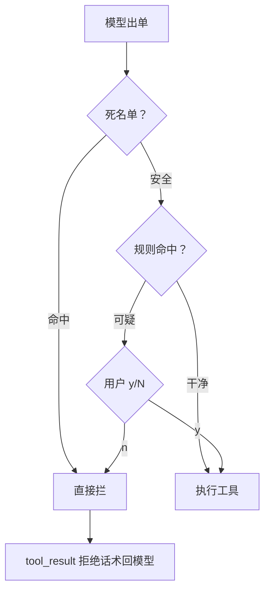
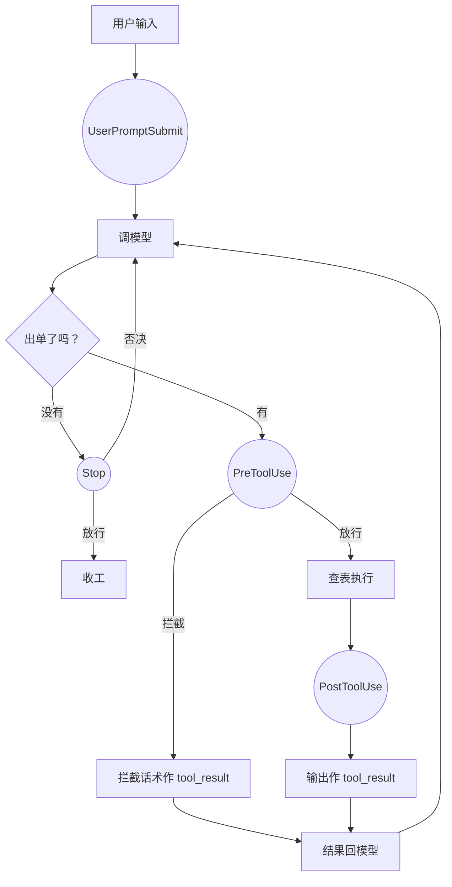

# 第 4 课总结 · 复习专用

## 一、上节课（第 3 课 · Permission）的流程



伪代码：

```
def check_permission(block):
    if bash 且 check_deny_list(command): return False     # 闸1
    if check_rules(name, input):                          # 闸2
        if ask_user(...) == "deny": return False          # 闸3
    return True

# 循环体内直接调用：
if not check_permission(单子): results.append("Permission denied."); continue
```

## 二、这节课（第 4 课 · Hooks）的流程



伪代码：

```
HOOKS = {事件名: [钩子函数列表]}
def trigger_hooks(event, *args):
    for cb in HOOKS[event]:
        r = cb(*args)
        if r is not None: return r     # 第一个非 None 说了算
    return None

# 循环里的三处接线：
收工前: force = trigger_hooks("Stop", messages); if force: 塞回去 continue
单子前: blocked = trigger_hooks("PreToolUse", block); if blocked: 回填话术 continue
执行后: trigger_hooks("PostToolUse", block, output)
# 权限规则没搬家：hooks.permission_hook 只是转调 permission.py 的三道闸
```

## 三、这节课在上节基础上加了什么

| 位置 | 加了什么 |
|---|---|
| `mini_claude/hooks.py`（全新） | 四个挂点（UserPromptSubmit/PreToolUse/PostToolUse/Stop）+ register/trigger；permission_hook（转调第 3 课规则，返回话术或 None）；出厂钩子 log/large_output/context_inject/summary；注册顺序 permission 先于 log |
| `mini_claude/loop.py` | `if not check_permission(...)` 改为 `trigger_hooks("PreToolUse", block)`；新增 Stop 挂点（可否决收工，塞回一句话继续）与 PostToolUse 挂点；不再 import permission |
| `mini_claude/__main__.py` | 用户输入前过 `trigger_hooks("UserPromptSubmit", query)` |
| `tests/` | 第 1 课拦截断言改具体话术；第 3 课循环测试改 patch builtins.input；新增第 4 课 6 项（含 Stop 强制续跑、注册表隔离 fixture） |

**借助的新库/新表**：零新第三方库；无数据库表；无新文件落盘。新工程手法：autouse fixture 隔离模块级状态。

**一句话增量**：权限从循环体内搬进 PreToolUse 钩子；循环新增四个挂点——从此一切"到点该做的杂事"都外挂，loop.py 到第 17 课都不用再碰。

## 四、自测三问

1. 四个挂点里哪两个有"管事权"？分别管什么？（PreToolUse 拦截调用单；Stop 否决收工。另两个是旁观：UserPromptSubmit 只过目，PostToolUse 只能看定稿结果）
2. 为什么 permission_hook 里不复制规则代码？（只搬接法不搬家产：转调 permission.py，单一事实来源，第 3 课测试照常有效）
3. 被拦的单子为什么没有日志？（permission_hook 挂在 log_hook 前面且返回非 None，trigger_hooks 第一个非 None 即返回）
