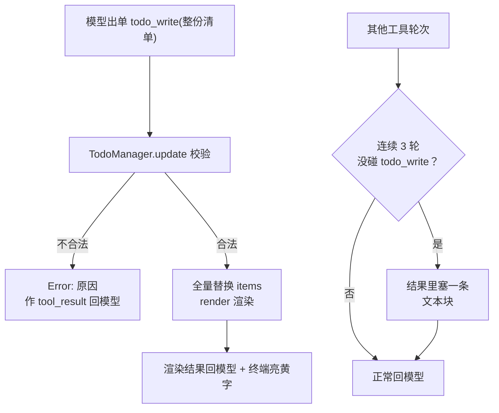

# 第 5 课主教案 · TodoWrite：先列计划，再干活

## 〇、开始前：把代码切到本课的状态

本课完成时的代码状态打了 git 标签 `lesson-05`：

```sh
git checkout lesson-05        # 切到本课刚完成时的状态
git checkout main             # 看完回主线
git diff lesson-04 lesson-05 -- mini_claude/ tests/   # 本课相对上节的全部增量
```

## 课程信息卡

| 项 | 内容 |
|---|---|
| 课程编号 | 第 5 课 / 共 18 课 |
| 所属阶段 | 阶段二 · 让 Agent 扛住复杂工作（第 5–8 课），本课是开门课 |
| 本节目标 | 让模型先列计划再执行：todo_write 工具 + 清单保管员 + 三轮未更新提醒 |
| 上节遗留问题 | 多步骤任务会"漂"：聊天记录里全是流水账，"该做哪几步、做到哪了"没有专门的地方放 |
| 本节新增能力 | 结构化计划（三态清单）、唯一 in_progress 的专注铁律、提醒机制、handler 异常兜底 |
| 涉及文件 | 新增 `mini_claude/todo.py`、`tests/test_lesson05_todo.py`；修改 `mini_claude/tools.py`、`mini_claude/loop.py`、`mini_claude/__init__.py` |
| 环境与依赖 | 无新第三方库（json/ast 是标准库） |
| 如何验证 | `.venv/bin/python -m pytest -q` 应见 43 passed |
| 读完你应该能说出 | ① 清单为什么全量替换；② 为什么只允许一条 in_progress；③ reminder 在哪一步、以什么形式塞给模型 |
| 进度地图 | 阶段一 1→…→4 ✅ ‖ 阶段二 ▶ [**5**]→6→7→8 ‖ 阶段三 9→…→12 ‖ 阶段四 13 ‖ 阶段五 14→15 ‖ 阶段六 16→17→18 |

---

## 一、定位

### 功能定位

阶段一的 Agent 工具齐、刹车灵，但接一个三步以上的任务就会"漂"：步骤记不全、顺序乱掉、干着干着忘了目标。根源是**计划这件事在它的世界里没有落脚点**——messages 里只有命令和输出的流水账。

本节课解决它。做完之后的新能力是：接手多步任务时，模型先提交一份结构化计划，Harness 保管、校验、督促更新，模型的每一步都对着清单走。原项目作者引用过一个观察：这一招让多步任务的完成率大约翻倍——不是模型变聪明了，是它终于不用把"计划"挤在流水账里了。

### 代码定位

**空间位置**：`todo.py` 是项目里第一个"不碰真实世界"的模块——它不执行命令、不读写文件，只保管**状态**。它位于工具分发表的下游（todo_write 被调用时），又是 system prompt 语义的上游（SYSTEM 里的计划指导语）。这个"纯状态模块"的形状你记住，第 10 课的任务系统是它的放大版，第 9 课的记忆系统是它的亲戚——整个项目的后半个课程，其实都在做各种"Harness 替模型保管的状态"。

**时间位置**：为什么现在做？因为前四课把"执行侧"修完了（工具、权限、钩子），模型的执行能力已经过剩，瓶颈转移到了"决策质量"——而计划是决策质量的最低成本保险。另外注意本课顺手做的两件小事：给 handler 加异常兜底（工具炸了不再连累循环），给 SYSTEM 加计划指导语——都是"模型行为开始需要精细管理"的信号，这个信号到第 8 课（上下文管理）会变成主旋律。

---

## 二、代码理解

本课增量：新文件 todo.py（保管员+工具入口）、tools.py 登记一笔、loop.py 三处小手术。逐段读。

### 2.1 TodoManager：清单的唯一保管人

```python
MAX_TODOS = 20
VALID_STATUS = ("pending", "in_progress", "completed")
MARKERS = {"pending": "[ ]", "in_progress": "[>]", "completed": "[x]"}


class TodoManager:
    def __init__(self):
        self.items: list[dict] = []

    def update(self, todos: list | str) -> str:
        if isinstance(todos, str):
            try:
                todos = json.loads(todos)
            except json.JSONDecodeError:
                try:
                    todos = ast.literal_eval(todos)
                except (SyntaxError, ValueError) as e:
                    raise ValueError("todos must be a list or JSON array string") from e

        if not isinstance(todos, list):
            raise ValueError("todos must be a list")
        if len(todos) > MAX_TODOS:
            raise ValueError(f"Max {MAX_TODOS} todos allowed")
        ...
```

先看模块顶上三个常量——上限 20 条、合法状态、渲染记号。**上限是给模型留的护栏**：清单超过 20 条说明它把计划写成流水账了，退回去重来比接受一份废计划好。

`update` 的开头是那段"宽容解析"：模型交上来的可能是列表，也可能是字符串（JSON 格式，或者带单引号的 Python 字面量格式——模型偶尔会串台）。两层解析都失败才抛 ValueError。注意这里的**校验哲学**：类型不对、超过上限、状态非法，全部抛 ValueError——因为 `update` 是内部函数，异常会让调用方决定怎么处理；而它上面的工具入口会把异常翻译成人话。

中间那段逐条校验（省略号里）做了四件事：每条必须是字典、content 非空、status 必须是三种之一、统计 in_progress 数量。最后：

```python
        if in_progress_count > 1:
            raise ValueError("Only one todo can be in_progress at a time")

        self.items = validated
        return self.render()
```

**铁律出场：同时只许一条"正在做"。**为什么？模型号称可以并行多线，但实际上它的注意力是串行的——清单上挂着五个 `[>]`，等于没有重点。一条 in_progress 逼着它"做完一步，更新一步，再开下一步"。校验全过，`self.items = validated` **整体替换**，然后立刻渲染返回。全量替换的深意再强调一遍：模型每次提交都对全局重新表一次态，Harness 永远只存"最新版本的完整计划"，不需要处理"某条改了一半"的脏状态。

### 2.2 render：给模型和终端看的同一张表

```python
    def render(self) -> str:
        if not self.items:
            return "No todos."

        lines = [f"{MARKERS[t['status']]} {t['content']}" for t in self.items]
        done = sum(t["status"] == "completed" for t in self.items)
        lines.append(f"\n({done}/{len(self.items)} completed)")
        return "\n".join(lines)
```

`[x] 读代码`、`[>] 改代码`、`[ ] 跑测试`，末尾一行进度 `(1/3 completed)`。这份渲染会出现在两个地方：终端（黄字标题下）和 tool_result（回给模型）。**同一张表、两个读者**——模型靠它对表，你靠它监督。这个"渲染视图"的模式值得记住：状态和视图分离，后面第 10 课任务列表、第 16 课的进度事件都是这个路数。

### 2.3 工具入口：错误翻译官

```python
TODO = TodoManager()


def run_todo_write(todos: list | str) -> str:
    try:
        output = TODO.update(todos)
    except ValueError as e:
        return f"Error: {e}"
    print(f"\n\033[33m## Current Tasks\033[0m\n{output}")
    return output


TODO_TOOL = { "name": "todo_write", "description": "Create and manage a task list...",
              "input_schema": { ... todos 是数组，元素必须有 content 和 status ... } }
```

`TODO` 是模块级的单例——整个进程共享一份清单（它就是本课的"会话状态"）。`run_todo_write` 把 ValueError 翻译成 "Error: ..." 字符串返回——**模型的输入错误是正常工作事件，不是程序事故**，这个立场从第 1 课的危险命令拦截一路贯穿到现在。`TODO_TOOL` 的 schema 里出现了两个新面孔：`"type": "array"`（数组参数）和 `"enum"`（枚举，把 status 的三种取值写死在说明书里，模型照着填基本不会错）。说明书越具体，校验越省心。

tools.py 的登记就两笔，第 2 课承诺的"加新工具只加一行"第二次兑现：

```python
TOOLS = [ ..., todo.TODO_TOOL ]
TOOL_HANDLERS = { ..., "todo_write": todo.run_todo_write }
```

### 2.4 loop.py 的三处手术

**手术一，SYSTEM 里的计划指导语**：

```python
SYSTEM = (
    f"You are a coding agent. Workspace: {WORKDIR}. "
    "Use the available tools to solve tasks. Act, don't explain. "
    "All destructive operations require user approval. "
    "Before starting any multi-step task, use todo_write to plan your steps. "
    "Update status as you go."
)
```

"多步任务先列计划，边干边更新状态"——光有工具不够，得告诉模型什么时候用、怎么用。**SYSTEM 每课都在长，它的长度就是 Harness 对模型行为管理的颗粒度**。

**手术二，handler 异常兜底**（本课的隐藏主角）：

```python
            handler = TOOL_HANDLERS.get(block.name)
            try:
                output = handler(**block.input) if handler else f"Unknown: {block.name}"
            except Exception as e:
                output = f"Error: {e}"
```

为什么要加？想想 todo_write 的处境：它要校验模型提交的数据，而校验是会抛异常的。若模型提交了非法清单，异常一炸，整个循环崩掉，前面跑了几轮的工作全丢。加了兜底，异常变成 tool_result 交回模型——它看到错误自己改。**从这节课起，工具层炸任何异常，循环都稳如老狗**。这个兜底是原项目 s05 引入的，位置在 loop 里；第 6 课会把它抽进 execute_tool，因为子代理也要用。

**手术三，提醒计数器**：

```python
    rounds_since_todo = 0
    while True:
        ...
        # 循环体内，处理完本轮工具结果之后：
        rounds_since_todo = 0 if used_todo else rounds_since_todo + 1
        if rounds_since_todo >= REMINDER_ROUNDS:
            results.append({"type": "text",
                            "text": "<reminder>Update your todos.</reminder>"})
            rounds_since_todo = 0
```

`used_todo` 在处理工具单时记录"本轮模型碰过 todo_write 吗"。连续三轮没碰，就把一条 `<reminder>` 文本块**混进工具结果消息**（注意：它跟 tool_result 挤在同一条 user 消息里，是 content 列表里的一个 text 块），然后计数器归零。为什么要提醒？因为"记得更新清单"对模型来说和对人类一样难——它会埋头干活忘了对表。`<reminder>` 这个尖括号格式是给模型看的信号标记，原项目和真实 Claude Code 都用这种风格。还有个细节：计数器是 `agent_loop` 的**局部变量**，每次提问重新开始——提醒管的是"这一轮任务里别漂了"，跨任务不留账。

---

## 三、运行时辅助理解

示例输入：

> 用户：「帮我把服务的超时从 30 秒改到 120 秒」

真实运行（假模型剧本，剧本里模型 behaves 完美：先计划、边干边更新）。终端输出：

```
> todo_write
## Current Tasks
[>] 读配置文件
[ ] 修改参数
[ ] 重启服务
(0/3 completed)
> bash
已读取 config.yaml 并找到超时参数
> todo_write
## Current Tasks
[x] 读配置文件
[>] 修改参数
[ ] 重启服务
(1/3 completed)
> bash
已把 timeout=30 改为 timeout=120
> todo_write
## Current Tasks
[x] 读配置文件
[x] 修改参数
[x] 重启服务
(3/3 completed)
[HOOK] Stop: session used 5 tool calls
模型调用次数: 6
```

看清楚节奏：**每次动状态之前或之后，模型都提交了一次整份清单**（状态从 `[>]` 挪到 `[x]`，计数从 0/3 爬到 3/3）。messages 里的对应关系是——每一轮 todo_write 的渲染结果都以 tool_result 回给模型（它下一轮"看得见"自己的表），Stop 钩子统计的 5 次工具调用 = 3 次 todo_write + 2 次 bash。

外部状态变化交代：本课没有任何数据库表、没有文件落盘——清单住在内存的 `TODO.items` 里，会话结束就消失。它要的是"这一轮任务的专注"，不是"永久记录"；要永久记录的是第 9 课的记忆和第 10 课的任务系统，别急。

自己跑：`.venv/bin/python -m pytest tests/test_lesson05_todo.py -v`；真实体验配好 key 后给一个三步小任务（"创建 hello.txt 写入 hi，再读出来确认，最后告诉我文件多大"），看它开口第一件事是不是列清单。

---

## 四、流程图理解



图后导读：左边半张是"提交计划"的路——模型每次把整份清单交给保管员，校验不过就带着错误原因回去重写，过了就全量替换并渲染，渲染结果同时去往终端和模型自己的视野；右边半张是"督促"的路——循环在心里数着"几轮没更新清单了"，数满三轮就往下一批结果里混进一句提醒，然后重新计数。两条路独立运转，共同保证一件事：清单始终是新的、且始终有一条 in_progress 在牵着模型的注意力。对照代码：B/C/D 在 `todo.py` 的 update/render，G/H 就是 loop.py 里那三行计数器；而本课新增的 handler 异常兜底不在图上——它是一条隐形的保险丝，任何一步工具爆炸时，火花都会被引到"Error: ..."这条回模型的路上，而不是烧掉整个循环。

---

## 五、环境与依赖

零新第三方依赖（json、ast 都是标准库），但有两个小知识点值得登记：

- **ast.literal_eval vs json.loads**：都能把字符串变数据，但 json 只认双引号语法，`literal_eval` 只认"安全的 Python 字面量"（数字、字符串、列表、字典——它**拒绝执行**任何函数调用，所以不怕模型夹带私货）。两层兜底不是为了严谨，是因为模型真的两种都会写。
- **模块级单例与测试隔离**：`TODO = TodoManager()` 是全进程共享的，测试里会互相污染。解法还是 monkeypatch：`monkeypatch.setattr(todo, "TODO", TodoManager())` 给每个用例换一份全新清单（`tools.run_todo_write` 内部引用的是 `todo.TODO` 这个"模块属性"，所以换得动——第 3 课讲过的"模块.属性"写法在这里兑现价值）。常见错误：在测试里直接改 `todo.TODO.items` 却不恢复，下个用例继承了脏清单。

---

## 六、本节进度地图与下一课预告

**当前进度**：阶段一 1→…→4 ✅ ‖ 阶段二 ▶ [**5**]→6→7→8 ‖ 阶段三 9→…→12 ‖ 阶段四 13 ‖ 阶段五 14→15 ‖ 阶段六 16→17→18

**下一课预告（第 6 课 · Subagent）**：清单管住了"步骤漂移"，但还有一种漂它管不了——**上下文漂移**。让主 Agent 去干一件脏活（比如"在 200 个文件里搜某个函数的用法"），它翻了几十个文件后，聊天记录里塞满了中间结果，主任务的思路都被淹了。下节课我们给子任务开**小灶**：一段全新的空白 messages、干完只把一句话结论带回来。你会看到本项目最优雅的一次代码复用——同一个循环形状，跑在两个嵌套的层级里。

原项目对照阅读（补充材料）：`learn-claude-code/s05_todo_write/README.zh.md`。
