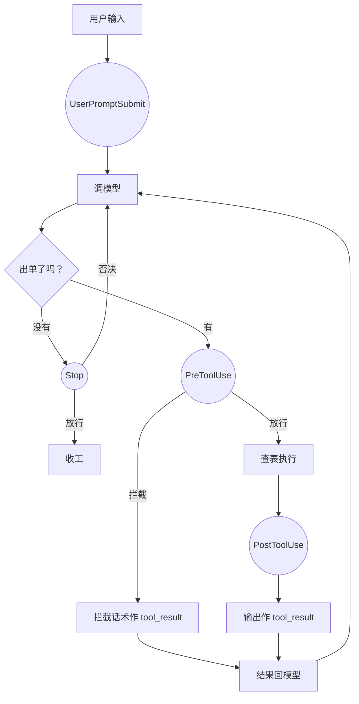
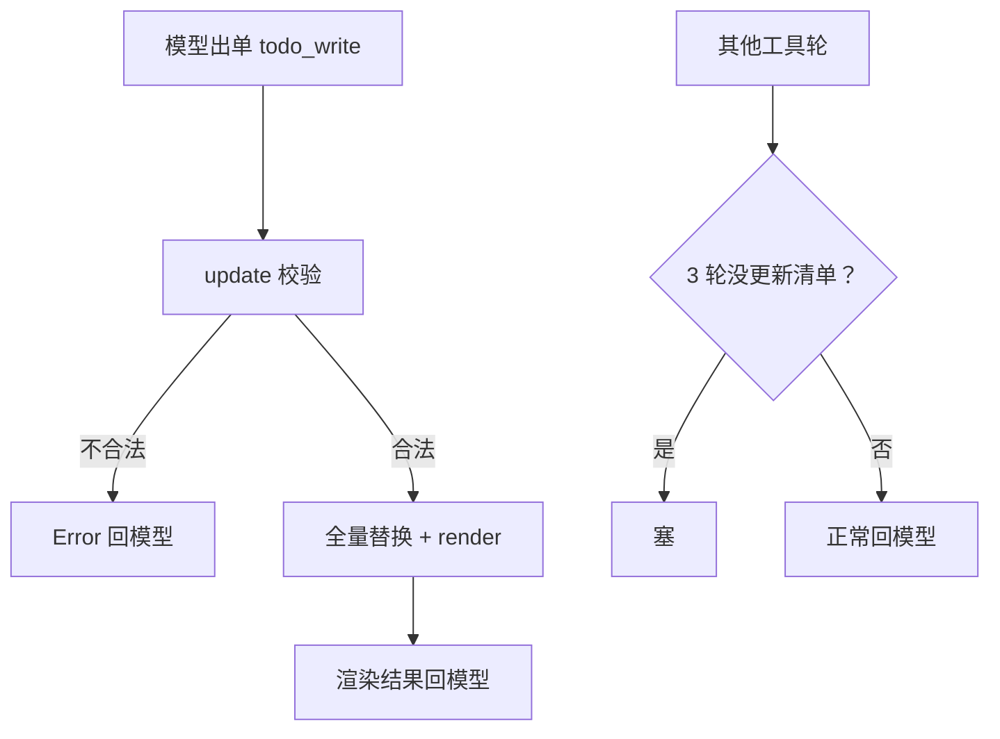

# 第 5 课总结 · 复习专用

## 一、上节课（第 4 课 · Hooks）的流程



伪代码：

```
# 循环里的三处接线：
收工前: force = trigger_hooks("Stop", messages); if force: continue
单子前: blocked = trigger_hooks("PreToolUse", block); if blocked: continue
执行后: trigger_hooks("PostToolUse", block, output)
# 权限规则在 permission.py，钩子只转调
```

## 二、这节课（第 5 课 · TodoWrite）的流程



伪代码：

```
class TodoManager:
    def update(todos):  # str→json→literal_eval 两层宽容解析
        校验: ≤20条 / content非空 / status三选一 / in_progress≤1
        self.items = 新清单            # 全量替换
        return self.render()           # [ ]/[>]/[x] + (n/N completed)

# 循环里：
try: output = handler(**input)
except Exception as e: output = f"Error: {e}"      # 异常兜底，循环不炸
rounds_since_todo = 0 if used_todo else +1
if rounds_since_todo >= 3:
    results.append(text: "<reminder>Update your todos.</reminder>")
```

## 三、这节课在上节基础上加了什么

| 位置 | 加了什么 |
|---|---|
| `mini_claude/todo.py`（全新） | TodoManager（宽容解析、四项校验、唯一 in_progress 铁律、全量替换、render 视图）；模块级单例 TODO；run_todo_write（ValueError→"Error: "字符串）；TODO_TOOL 说明书（array + enum schema） |
| `mini_claude/tools.py` | TOOLS/TOOL_HANDLERS 各登记一笔 todo_write（查表分发第二次兑现） |
| `mini_claude/loop.py` | SYSTEM 加计划指导语；handler 包 try/except（异常变 tool_result）；rounds_since_todo 计数器 + 3 轮注入 `<reminder>` 文本块 |

**借助的新库/新表**：零新第三方库（json/ast 标准库）；无数据库表、无文件落盘——清单住内存，会话级状态。新 schema 写法：array / enum / maxItems。

**一句话增量**：Agent 有了"先写计划、对表干活"的工作方式；Harness 第一次替模型保管了一份结构化状态（虽然还只在内存里）。

## 四、自测三问

1. 清单为什么全量替换而不是逐条改？（模型每次对全局重新表态；Harness 只存最新完整版，无脏状态）
2. 为什么同时只允许一条 in_progress？（模型的注意力是串行的：一条 in_progress 逼它线性推进）
3. reminder 以什么形式、在哪里进入对话？（text 块混在工具结果那条 user 消息里；连续 3 轮未更新时注入并归零计数器）
