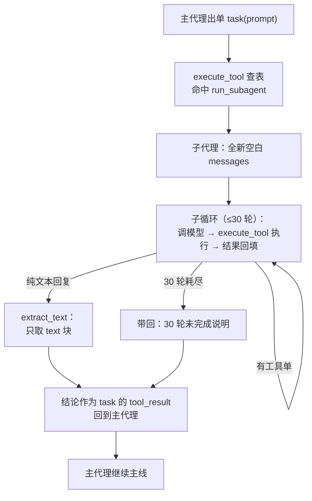

# 第 6 课主教案 · Subagent：给子任务一段独立上下文

## 〇、开始前：把代码切到本课的状态

本课完成时的代码状态打了 git 标签 `lesson-06`：

```sh
git checkout lesson-06        # 切到本课刚完成时的状态
git checkout main             # 看完回主线
git diff lesson-05 lesson-06 -- mini_claude/ tests/   # 本课相对上节的全部增量
```

## 课程信息卡

| 项 | 内容 |
|---|---|
| 课程编号 | 第 6 课 / 共 18 课 |
| 所属阶段 | 阶段二 · 让 Agent 扛住复杂工作（第 5–8 课） |
| 本节目标 | 新增 task 工具：子代理在全新 messages 里跑循环，最终文本作为 tool_result 返回 |
| 上节遗留问题 | 上下文污染：脏活的中间结果堆进主对话，淹没主任务的思路 |
| 本节新增能力 | 上下文隔离的子代理、30 轮熔断、主/子代理共享工具执行管线（execute_tool）、防套娃 |
| 涉及文件 | 新增 `mini_claude/subagent.py`、`tests/test_lesson06_subagent.py`；修改 `mini_claude/hooks.py`、`mini_claude/loop.py`、`mini_claude/__main__.py`、`mini_claude/__init__.py` |
| 环境与依赖 | 无新第三方库 |
| 如何验证 | `.venv/bin/python -m pytest -q` 应见 50 passed |
| 读完你应该能说出 | ① 子代理"新"在哪、什么能回来什么不能；② execute_tool 抽出来的动机；③ 防套娃是怎么实现的 |
| 进度地图 | 阶段一 1→…→4 ✅ ‖ 阶段二 ▶ 5→[**6**]→7→8 ‖ 阶段三 9→…→12 ‖ 阶段四 13 ‖ 阶段五 14→15 ‖ 阶段六 16→17→18 |

---

## 一、定位

### 功能定位

清单管住了"步骤漂移"，但管不住"上下文污染"——模型的全部思考都发生在 messages 这一张纸上，过程垃圾一多，主任务的思路就被挤到纸的边缘去了（到第 8 课你会知道，这张纸还有硬性的物理长度限制）。

本节课解决它。新能力：模型可以把一件自包含的脏活（探索、调研、批量检查）打包成一张 `task(prompt)` 单，分身在**零共享的全新上下文**里跑完整个循环，只带回一段文字结论。主对话从此保持"只谈主线"的整洁。

### 代码定位

**空间位置**：本课真正的主角其实有两处。第一处是 [hooks.py 的 execute_tool](/home/shitanli/ln_rebuild_skill5_zcode/learn_claude_code_st/mini_claude/hooks.py)——把"过闸→执行→旁观"这条管线从主循环里抽出来变成公共函数，因为马上有两个客户要用它（主代理和子代理）；第二处才是 subagent.py 的嵌套循环。依赖方向特意设计过：`loop.py → subagent.py → tools.py/hooks.py`，单向不回头——tools.py 里没有 task，task 是 loop.py 在父代理工具池里现装的（`PARENT_TOOLS = [*TOOLS, TASK_TOOL]`）。所以子代理从 tools.py 拿到的池子天然不含 task，防套娃不是靠 if 拦截，是**靠依赖方向兜底**——这是本课最值得品的一个设计。

**时间位置**：为什么等到现在？因为子代理复用的是前五课的全部家当：查表分发（第 2 课）、权限（第 3 课）、钩子（第 4 课）、甚至 Stop 挂点（第 4 课）。如果第 2 课就做子代理，它得带着一大堆"待接入"的占位。现在做，是水到渠成——**新机制出现在它恰好能完整复用旧机制的时刻**，课程编排本身就在演示架构的演化逻辑。

---

## 二、代码理解

本课增量：hooks.py 抽出 execute_tool、新文件 subagent.py、loop.py 组装父工具池。逐段读。

### 2.1 先动一刀：execute_tool 从循环里搬出来

```python
def execute_tool(block, handlers: dict) -> str:
    """一次工具调用的标准流程：过闸 -> 执行（异常兜底）-> 旁观。"""
    blocked = trigger_hooks("PreToolUse", block)
    if blocked:
        return str(blocked)

    handler = handlers.get(block.name)
    try:
        output = handler(**block.input) if handler else f"Unknown: {block.name}"
    except Exception as e:
        output = f"Error: {e}"

    trigger_hooks("PostToolUse", block, output)
    return str(output)
```

这十四行你应该全都眼熟——它们昨天还长在 agent_loop 的 for 循环体内（第 5 课刚加的异常兜底也在里面）。搬出来的原因很实际：**子代理也要执行工具，规矩必须和主代理完全一致**（同样的权限、同样的钩子、同样的异常翻译），否则"分身"就成了法外之地。与其复制一份，不如抽成函数让两边的循环都调用。顺便注意签名里的 `handlers` 参数——执行管线不绑定具体哪张分发表，谁调用谁递进来，主代理递 PARENT_HANDLERS，子代理递自己的基础表。

主循环那边相应地瘦了：

```python
        for block in tool_calls:
            print(f"\033[36m> {block.name}\033[0m")
            output = execute_tool(block, PARENT_HANDLERS)
            print(str(output)[:200])
```

（老师修过一个自己造成的小 bug，正好当教材：抽出 execute_tool 时循环里残留了旧的 PostToolUse 触发，钩子一回合被叫两次，测试立刻红了。**重构后旧的接线要拆干净，不然同一件事发生两遍**——测试抓的就是这个。）

### 2.2 subagent.py：镜像循环

```python
MAX_TURNS = 30

SESSION = {"client": None, "model": None}


def bind(client, model) -> None:
    SESSION["client"] = client
    SESSION["model"] = model


SUB_SYSTEM = (
    "You are a focused coding subagent. Complete the given task, "
    "then return a concise final answer."
)
```

开头三个小件。`SESSION` 存放 API 客户端和模型名——为什么搞这个而不是把 client 塞进函数签名？因为 run_subagent 最终要登记进分发表，调用时只有模型给的一个 prompt 参数（回顾第 2 课的 `handler(**block.input)`——参数形状由说明书定死）。所以客户端凭证走"模块级会话"这条路：REPL 启动时 `bind()` 注入一次，测试时直接 monkeypatch 整个 SESSION。这是个诚实的妥协，真实框架里这叫"运行时上下文"。

`SUB_SYSTEM` 跟主 SYSTEM 的差别值得对比着读：主代理被鼓励"规划、对表、派分身"，分身只被要求"完成任务，给一段简洁的最终答复"。**岗位说明书随岗位变**——分身是临时工，不需要长期主义的提示词。

```python
def run_subagent(prompt: str) -> str:
    print("\n\033[35m[Subagent started]\033[0m")
    messages = [{"role": "user", "content": prompt}]   # 全新空白，与主代理零共享

    for _ in range(MAX_TURNS):
        response = SESSION["client"].messages.create(
            model=SESSION["model"], system=SUB_SYSTEM,
            messages=messages, tools=TOOLS, max_tokens=8000,
        )
        messages.append({"role": "assistant", "content": response.content})

        tool_calls = [
            block for block in response.content if block.type == "tool_use"
        ]
        if not tool_calls:
            force = trigger_hooks("Stop", messages)
            if force:
                messages.append({"role": "user", "content": force})
                continue
            print("\033[35m[Subagent done]\033[0m")
            return extract_text(response.content) or "(no summary)"

        results = []
        for block in tool_calls:
            output = execute_tool(block, TOOL_HANDLERS)
            print(f"  \033[90m[sub] {block.name}: {output[:100]}\033[0m")
            results.append({
                "type": "tool_result",
                "tool_use_id": block.id,
                "content": output,
            })
        messages.append({"role": "user", "content": results})

    print("\033[35m[Subagent stopped]\033[0m")
    return f"Subagent stopped after {MAX_TURNS} turns without a final answer."
```

逐点看。第一行函数体的 `messages = [...]` 是**整课的心脏**：一个全新的列表，起点只有任务描述本身——跟主代理的 history 没有一个字节共享，这就是"上下文隔离"的全部实现，朴素到让人愣一下。循环用的 `tools=TOOLS` 是 tools.py 的基础池（bash、文件五件套、todo_write），**没有 task**——分身派不了分身，防套娃在依赖方向上已经完成了。

`for _ in range(MAX_TURNS)` 是熔断丝：while True 会陪模型玩到天荒地老，for 上限 30 轮，轮数耗尽返回一句说明文字而不是异常——熔断也是结果，不是事故。里面收工的判断跟主循环同款：没有工具单 → 过 Stop 挂点（对，分身收工也归钩子管）→ `extract_text` 把回复里的文本块拼成一段字符串返回。`or "(no summary)"` 防一个空回复的边角：模型有时只出 tool_use 块不说话，返回空串不如返回占位话。

`extract_text` 单独看一眼：

```python
def extract_text(content) -> str:
    if not isinstance(content, list):
        return str(content)
    return "\n".join(
        getattr(block, "text", "")
        for block in content
        if getattr(block, "type", None) == "text"
    )
```

这就是"只带结论回家"的字面实现：遍历回复的内容块，只要 text 块，用换行拼起来。tool_use 块、别的什么块，一律不带走。**子代理的一生浓缩成返回值的那一刻，行李限制只有一条：纯文本。**

```python
TASK_TOOL = {
    "name": "task",
    "description": "Run a subagent with fresh conversation context and return its final text.",
    "input_schema": {"type": "object",
                     "properties": {"prompt": {"type": "string", "minLength": 1}},
                     "required": ["prompt"]},
}
```

说明书就一个参数 prompt。但注意 description 写得多用心："fresh conversation context"和"final text"这两个词就是在教模型**怎么用**这个工具——什么时候派分身（自包含的子任务）、能拿回什么（一段文字）。工具越抽象，说明书越要教用法。

### 2.3 loop.py：给父代理装上 task

```python
from .subagent import TASK_TOOL, run_subagent

PARENT_TOOLS = [*TOOLS, TASK_TOOL]
PARENT_HANDLERS = {**TOOL_HANDLERS, "task": run_subagent}
```

两行组装：父代理的工具池 = 基础池 + task，分发表同理。基础池原封不动留给子代理。`create` 时传 `tools=PARENT_TOOLS`。从此模型的工具单里可能出现 `task`，execute_tool 查 PARENT_HANDLERS 查到 `run_subagent`，嵌套就此发生。`__main__.py` 里加了一行 `subagent.bind(client, model)`——子代理复用主代理的 API 连接，不用重新读 .env。

---

## 三、运行时辅助理解

示例输入：

> 用户：「统计一下我们代码包里有多少个函数，过程不用告诉我」

真实运行（假模型剧本 + 真分身 + 真命令）：

```
> task                                    ← 主代理出了一张 task 单
[Subagent started]                        ← 分身进场，拿到全新空白 messages
[sub] bash: 31                            ← 分身在跑 grep 统计（真实执行了！）
[Subagent done]
结论：代码包里共有 31 个函数定义。          ← 分身的一句结论
派分身统计完了：mini_claude 包里共有 31 个函数定义。   ← 主代理拿结论交差
---- 主代理历史 ----
消息条数: 4
```

三个数字值得盯着看：**主代理历史只有 4 条消息**（用户的话、task 单、一句 tool_result、最终总结）——分身跑的命令、grep 的输出，一个字都没进主历史；**分身被调用 2 次**（一次跑命令、一次交结论）；**Stop 钩子打了两条统计**（一条是分身收工时打的"1 tool call"，一条是主代理收工时打的——钩子在世界里的每一层都活着）。

对比一下没有子代理的世界：那 31 这个数字的产生过程（命令、输出、可能还有试错的中间命令）会全部摊在主对话里。任务越大，对比越悬殊。

外部状态变化：分身执行的是**真命令**，它能读、能写、能改磁盘——上下文隔离隔离的是"记忆"，不是"行为"。分身改了文件，主代理的世界里文件是真变了。这个区别很重要，第 13 课的团队协作会把它玩得更大。

自己跑：`.venv/bin/python -m pytest tests/test_lesson06_subagent.py -v`；真实体验配好 key 后问一个调研型问题（"看看这个仓库用到了哪些环境变量，只告诉我清单"），观察紫色 [Subagent started] 和缩进的 [sub] 行——那是分身在另一个世界干活的声音。

---

## 四、流程图理解



图后导读：整张图要分两个世界看——上半截是主代理的世界，它只是出了一张普通的工具单（A→B）；从 C 开始进入子代理的世界，一个和主循环同形状的小循环（调模型、执行工具、回填）在里面自转，直到它交出纯文本（E）或者撞上 30 轮的墙（H）；无论哪条路，最后都汇到 F：一段文字作为 tool_result 回到主代理的世界，嵌套结束。对照代码：B 就是 loop.py 里的 execute_tool 查表命中，C 就是 run_subagent 里那个一行的新 messages 列表，D 的"同形状"不是比喻——过闸、异常兜底、Stop 挂点，全是跟主循环共用同一份函数。本课的实质一句话：**不是造了一个新 Agent，是给同一个循环找了个干净的房间。**

---

## 五、环境与依赖

零新第三方依赖，工程要点记两条：

- **运行时上下文（SESSION 模式）**：工具函数的签名被协议锁死（只有模型给的参数），但它又需要环境资源（API 客户端）——解法是模块级 SESSION + bind 注入。测试时 `monkeypatch.setattr(subagent, "SESSION", {...})` 整个换掉。常见错误：测试里直接 `subagent.SESSION = ...` 而不用 monkeypatch，用例之间会互相泄漏（本课测试里就有这个反面教材的修正过程）。
- **防套娃靠依赖方向**：task 只存在于 loop.py 组装的 PARENT_TOOLS 里，tools.py 的基础池永远不含它。验证方式：`test_parent_pool_has_task_but_base_pool_does_not`。这类"结构性防错"比运行时 if 检查更可靠——错误配置在 import 的那一刻就注定不会发生。

---

## 六、本节进度地图与下一课预告

**当前进度**：阶段一 1→…→4 ✅ ‖ 阶段二 ▶ 5→[**6**]→7→8 ‖ 阶段三 9→…→12 ‖ 阶段四 13 ‖ 阶段五 14→15 ‖ 阶段六 16→17→18

**下一课预告（第 7 课 · Skill Loading）**：分身解决了"过程垃圾"，还有一种浪费它管不着——**知识全量前置**。今天我们的 SYSTEM 是固定的三句话，想教模型新本事（比如"怎么做代码评审"），只能把整本说明书塞进 SYSTEM，每次调用都背着，哪怕这次对话根本用不上。下节课我们学 Claude Code 的聪明做法：**目录常驻、正文按需**——启动时只把"有哪些技能"的一行行清单放进 SYSTEM，模型判断用得上时，再用 load_skill 工具把全文拉进对话。第一次第三方依赖 pyyaml 也将登场。

原项目对照阅读（补充材料）：`learn-claude-code/s06_subagent/README.zh.md`。
