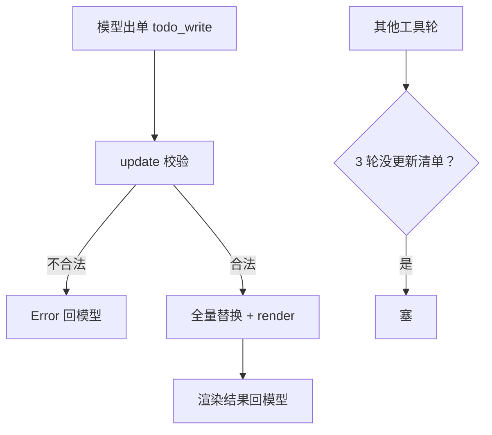
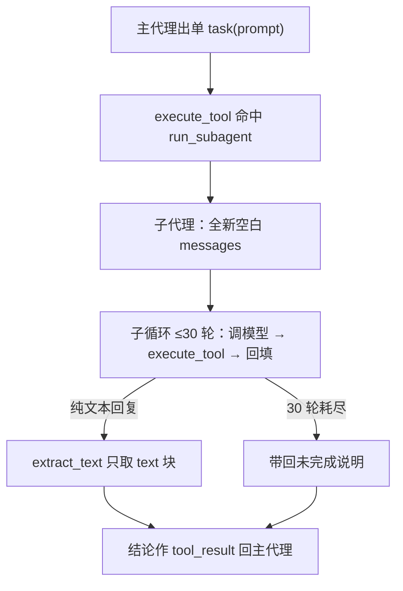

# 第 6 课总结 · 复习专用

## 一、上节课（第 5 课 · TodoWrite）的流程



伪代码：

```
TodoManager.update: 两层宽容解析 → 四项校验（≤20/非空/三态/唯一in_progress）
                  → 全量替换 items → render
循环: try/except 兜底 handler；3 轮没更新清单 → 注入 <reminder> 文本块
```

## 二、这节课（第 6 课 · Subagent）的流程



伪代码：

```
def execute_tool(block, handlers):          # 从循环抽出，主/子共用
    blocked = trigger_hooks("PreToolUse", block)
    output = handlers.get(block.name)(**block.input)  # try/except 兜底
    trigger_hooks("PostToolUse", block, output)
    return str(output)

def run_subagent(prompt):
    messages = [user: prompt]               # 心脏：全新空白上下文
    for _ in range(30):                     # 熔断丝
        response = 模型(SUB_SYSTEM, messages, tools=基础池)   # 无 task，防套娃
        if 纯文本: return extract_text(response)
        results = [execute_tool(每张单子)]
    return "30 轮未完成"

PARENT_TOOLS = [*TOOLS, TASK_TOOL]          # 只有父代理的池子里有 task
```

## 三、这节课在上节基础上加了什么

| 位置 | 加了什么 |
|---|---|
| `mini_claude/hooks.py` | execute_tool（过闸→执行+异常兜底→旁观→str 返回），从循环抽出的公共管线 |
| `mini_claude/subagent.py`（全新） | SESSION/bind 运行时凭证；SUB_SYSTEM；extract_text（只取 text 块）；run_subagent（全新 messages、30 轮熔断、Stop 挂点）；TASK_TOOL 说明书 |
| `mini_claude/loop.py` | PARENT_TOOLS/PARENT_HANDLERS 组装（基础池+task）；循环改用 execute_tool；SYSTEM 加 task 指导语 |
| `mini_claude/__main__.py` | subagent.bind(client, model)——分身复用同一 API 连接 |

**借助的新库/新表**：零新第三方库；无数据库表、无文件落盘。结构新知识：依赖方向防递归（tools.py 不含 task）、运行时上下文注入（SESSION）。

**一句话增量**：脏活打包成 task 单 → 分身在空白上下文里用同一套执行管线自转 → 只有文字结论回家；主对话保持整洁。

## 四、自测三问

1. 子代理和主代理共享什么、隔离什么？（共享：工具、权限、钩子、API 连接；隔离：messages 完全独立，只有最终文本返回）
2. 防套娃靠 if 判断吗？（不靠。task 只在 loop.py 的 PARENT_TOOLS 里，子代理从 tools.py 拿的基础池天然没有 task）
3. 子代理 30 轮耗尽后发生什么？（返回一句说明文字作为 tool_result，主代理照常继续——熔断是结果不是事故）
