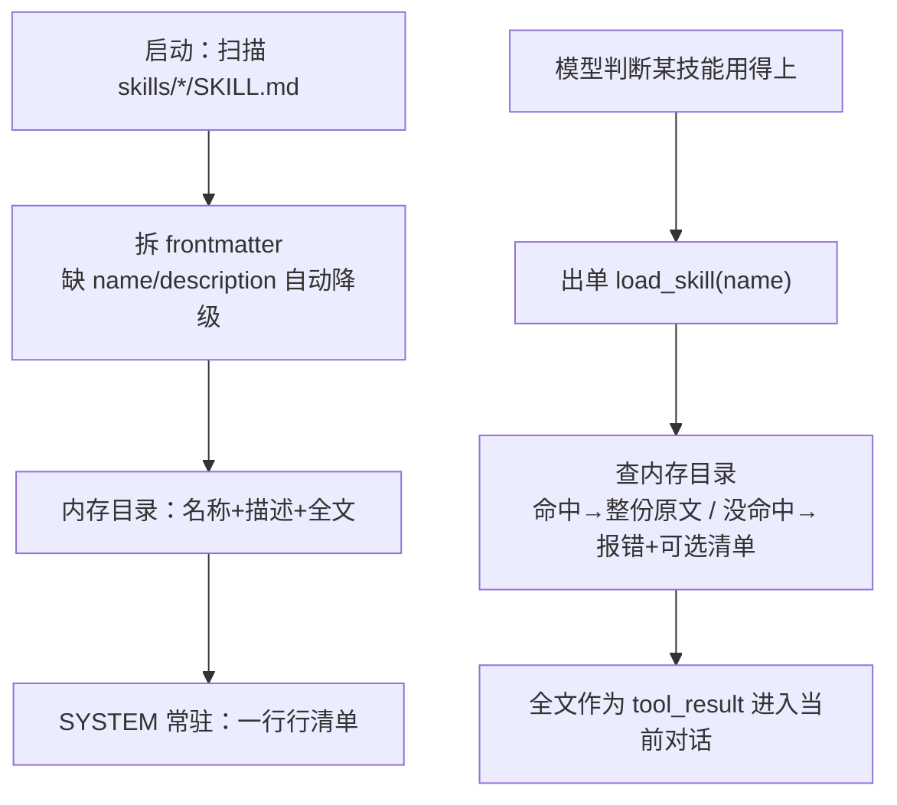

# 第 7 课主教案 · Skill Loading：目录常驻，正文按需

## 〇、开始前：把代码切到本课的状态

本课完成时的代码状态打了 git 标签 `lesson-07`：

```sh
git checkout lesson-07        # 切到本课刚完成时的状态
git checkout main             # 看完回主线
git diff lesson-06 lesson-07 -- mini_claude/ tests/ skills/   # 本课相对上节的全部增量
```

## 课程信息卡

| 项 | 内容 |
|---|---|
| 课程编号 | 第 7 课 / 共 18 课 |
| 所属阶段 | 阶段二 · 让 Agent 扛住复杂工作（第 5–8 课） |
| 本节目标 | 技能目录常驻 SYSTEM，load_skill 工具按需加载全文；pyyaml 登场 |
| 上节遗留问题 | 知识全量前置的浪费：任何一本手册进 SYSTEM 就要每次调用都背着，哪怕用不上 |
| 本节新增能力 | 启动扫描 skills/ 目录、SYSTEM 渲染技能目录、load_skill 按需取全文；宽容解析（frontmatter 缺失自动降级） |
| 涉及文件 | 新增 `mini_claude/skills.py`、`tests/test_lesson07_skills.py`、`skills/`（四个示例技能）；修改 `mini_claude/tools.py`、`mini_claude/loop.py`、`requirements.txt` |
| 环境与依赖 | **新第三方库 pyyaml**（解析 frontmatter）；安装 `uv pip install pyyaml` |
| 如何验证 | `.venv/bin/python -m pytest -q` 应见 60 passed |
| 读完你应该能说出 | ① 两级加载各发生在什么时刻、花什么钱；② frontmatter 缺失时怎么降级；③ load_skill 的结果进 SYSTEM 还是进对话 |
| 进度地图 | 阶段一 1→…→4 ✅ ‖ 阶段二 ▶ 5→6→[**7**]→8 ‖ 阶段三 9→…→12 ‖ 阶段四 13 ‖ 阶段五 14→15 ‖ 阶段六 16→17→18 |

---

## 一、定位

### 功能定位

到现在为止，教模型新本事的唯一通道是 SYSTEM 提示词——每教一样就得往里塞一段，每次调用都付一次全款。本节课解决"知识的经济性问题"：引入技能文件体系（`skills/技能名/SKILL.md`），启动时只扫描名片（名称+描述）进 SYSTEM，正文由模型用 `load_skill` 工具按需拉取。新能力：**Agent 的知识库变成了可以随时往里加文件的目录**——想教会它一件事，写个 SKILL.md 扔进去就行，不用改任何代码。这个"加文件即扩展"的模式，就是第 14 课 MCP"加服务器即扩展"的先声。

### 代码定位

**空间位置**：`skills.py` 和上一课的 subagent.py 正好是一对镜像——subagent 是"执行侧"的复用（一套管线两个循环），skills 是"知识侧"的管理（一份目录两个读者）。它在依赖图的最底层：不 import 项目里任何模块（只有 yaml 和 pathlib），被 tools.py（登记工具）和 loop.py（渲染目录）引用。仓库根目录同时多了一个 `skills/` 数据目录——**代码读数据，数据不读代码**，这是它放最底层的另一个原因。

**时间位置**：为什么现在学"按需加载"？因为它是下一课（上下文压缩）的思想铺垫——两课其实是同一个问题的两面：**上下文的空间是稀缺资源**。第 7 课从"源头"省（不用的知识别进来），第 8 课从"存量"省（进来的旧结果清出去）。把这两课排在一起，你就能看到 Harness 管理上下文的完整思路：先节流，再清理。

---

## 二、代码理解

本课增量：新文件 skills.py、仓库根的 skills/ 数据目录、tools.py 登记一笔、loop.py 的 SYSTEM 改为组装式。逐段读。

### 2.1 先认识数据：SKILL.md 的长相

本课第一次出现"数据文件当主角"，先看一眼我们仓库里 `skills/code-review/SKILL.md` 的头部：

```
---
name: code-review
description: Perform thorough code reviews with security, performance...
---

# Code Review Skill

You now have expertise in conducting comprehensive code reviews...
```

头部两行 `---` 之间是 YAML 格式的元数据（name、description），正文是技能的完整教学内容。**名片（头部两行）便宜常驻，内脏（正文 157 行）按需进对话**——文件结构本身就是两级加载设计。仓库里还有 agent-builder、pdf、mcp-builder 三个技能，全是原项目提供的示例教材。

### 2.2 parse_frontmatter：把名片拆出来

```python
def parse_frontmatter(text: str) -> tuple[dict, str]:
    lines = text.splitlines(keepends=True)
    if not lines or lines[0].rstrip("\r\n") != "---":
        return {}, text

    closing_index = next(
        (index for index, line in enumerate(lines[1:], start=1)
         if line.rstrip("\r\n") == "---"),
        None,
    )
    if closing_index is None:
        return {}, text

    frontmatter = "".join(lines[1:closing_index])
    body = "".join(lines[closing_index + 1:]).strip()
    try:
        metadata = yaml.safe_load(frontmatter) or {}
    except yaml.YAMLError:
        metadata = {}
    if not isinstance(metadata, dict):
        metadata = {}
    return metadata, body
```

思路是纯手工的行扫描（为什么不用什么库一步到位？因为 frontmatter 约定就两行 `---`，手写十行代码更透明）：第一行不是 `---` 直接放弃（返回空字典+原文）；然后 `next(...)` 找结尾那行 `---` 的位置——`next` 带 default `None` 的写法是"在生成器里找第一个满足条件的，找不到给 None"；找到就把中间部分交给 `yaml.safe_load`。**注意是 safe_load 不是 load**：yaml 的 load 能执行文件里的任意构造器，`safe_load` 只解析纯数据——处理外来文件，这两个的区别是安全红线，记住它。最后的降级链也值得看：解析失败给空字典、"解析出来不是字典"也给空字典——**数据文件的每种坏法都要有体面的下场**。

### 2.3 SkillLoader：启动扫一遍，之后只查内存

```python
class SkillLoader:
    def __init__(self, skills_dir: Path):
        self.skills_dir = Path(skills_dir)
        self.skills: dict[str, dict[str, str]] = {}
        self.scan()

    def scan(self):
        self.skills.clear()
        if not self.skills_dir.exists():
            return
        skills_root = self.skills_dir.resolve()
        for manifest in sorted(self.skills_dir.glob("*/SKILL.md")):
            if (not manifest.is_file()
                    or not manifest.resolve().is_relative_to(skills_root)):
                continue
            content = manifest.read_text(encoding="utf-8")
            metadata, body = parse_frontmatter(content)
            raw_name = metadata.get("name")
            name = raw_name.strip() if isinstance(raw_name, str) else ""
            name = name or manifest.parent.name
            raw_description = metadata.get("description")
            description = (raw_description.strip()
                           if isinstance(raw_name, str) else "")
            description = description or body.split("\n", 1)[0]
            description = " ".join(str(description).lstrip("# ").split())
            self.skills[name] = {"name": name, "description": description, "content": content}
```

构造函数里就调 `scan()`——**启动时一次性读盘**，之后 catalog/load 全是查内存字典。扫描用 `glob("*/SKILL.md")`：只认"技能目录下的 SKILL.md"这一种文件名约定，目录里其他文件（示例、脚本）它根本不关心。中间是两段"降级链"，这是本课最值得学走的容错思维：**name 缺失 → 用目录名顶上；description 缺失 → 用正文第一行顶上**。数据永远可能缺胳膊少腿，好的加载器不是拒绝残缺数据，而是给每种残缺准备一个合理默认值。最后那个 `lstrip("# ").split() 再 join` 是把"多行、带井号、带多余空格"的描述压成干净的单行——目录视图的美观直接影响模型读目录的体验。

（老师必须自首：写这段时我把 `isinstance(raw_name, str)` 手滑抄成了 description 的判断，测试当场红了——降级链的每一环都该有测试盯着，`test_fallbacks_dir_name_and_first_line` 干的就是这个活。）

```python
    def catalog(self) -> str:
        if not self.skills:
            return "(no skills found)"
        return "\n".join(
            f"- {skill['name']}: {skill['description']}"
            for skill in self.skills.values()
        )

    def load(self, name: str) -> str:
        skill = self.skills.get(name)
        if skill:
            return skill["content"]
        available = ", ".join(self.skills) or "none"
        return f"Error: Unknown skill '{name}'. Available: {available}"
```

catalog 渲染成清单视图；load 命中返回**整份文件原文**（含 frontmatter，模型看到全貌没坏处），没命中返回错误并列出全部可选——**报错时把正确选项递到模型手上**，它下一轮就能自己纠正。这个细节跟第 2 课的 "Unknown: 工具名" 一脉相承。

### 2.4 接线：tools.py 一笔、loop.py 的 SYSTEM 变成组装式

```python
# tools.py
TOOLS = [ ..., skills.SKILL_TOOL ]
TOOL_HANDLERS = { ..., "load_skill": skills.LOADER.load }
```

分发表第三次登记。注意 handler 直接就是 `LOADER.load` 这个**绑定方法**——load 的签名（一个 name 参数）正好对上说明书的 input_schema，函数拿来即用，连包装都不用。这里有个 Python 小坑老师踩给你看过：测试里 `is skills.LOADER.load` 挂了，因为**每次访问 `.load` 都生成一个新的绑定方法对象**，`is` 比身份必挂，要比相等用 `==`（它比较 underlying 对象和方法）。

```python
# loop.py
def build_system_prompt() -> str:
    return (
        f"You are a coding agent. Workspace: {WORKDIR}. ... "
        "Use task for focused exploration or a self-contained subtask.\n\n"
        f"Skills available:\n{LOADER.catalog()}\n\n"
        "Use load_skill to read the full instructions when a skill applies."
    )


SYSTEM = build_system_prompt()
```

SYSTEM 从"一坨字符串"变成"一个组装函数"：岗位说明部分原样保留，下面拼上技能目录和一句使用指导。目录部分每个技能只占一行，四个技能也就八九行——**常驻成本一目了然地便宜**。注意启动时序：`LOADER = SkillLoader(...)` 在 import 时就扫完盘了，之后改技能文件要重启进程才生效（真实 Claude Code 也是这个语义，会话中途不热加载）。

---

## 三、运行时辅助理解

示例输入：

> 用户：「帮我评审一下最近改的代码」

真实运行记录（假模型剧本 + 真技能文件）：

```
> load_skill
[HOOK] load_skill(['code-review'])     ← 日志钩子记了一笔
---- 回给模型的 load_skill 结果（前 12 行）----
---
name: code-review
description: Perform thorough code reviews with security, performance...
---

# Code Review Skill

You now have expertise in conducting comprehensive code reviews...
## Review Checklist
### 1. Security (Critical)
...（共 157 行）
```

把两级加载的成本账摆出来看（这是本课真正要算的账）：

| 时刻 | 进入上下文的内容 | 大小 | 谁买单 |
|---|---|---|---|
| 每次调用模型（常驻） | SYSTEM 里的技能目录（4 行清单） | ~0.5 KB | 每轮都付，但便宜 |
| 模型调用 load_skill 那轮起 | code-review 全文 | ~8 KB | 只付一次，跟着当前对话 |
| 用不上的技能 | 什么都不进 | 0 | 0 |

对比全量前置方案：四个技能全文 ~30 KB 每轮都背。**省的不是一次开销，是"每轮都重复"的开销**——调用越多，差价越大。

自己跑：`.venv/bin/python -m pytest tests/test_lesson07_skills.py -v`；再亲手做一次"加文件即扩展"：`mkdir skills/my-skill && vi skills/my-skill/SKILL.md`（frontmatter 写上 name/description），重启 `python -m mini_claude`，看目录里多了一行——全程没改一行代码。

---

## 四、流程图理解



图后导读：图的上下两半对应两级加载的两个时刻——上半截发生在启动时（A→C 只读一次盘），产出两种东西：常驻的目录（D，每次调用都随 SYSTEM 出门）和待命的全文（存在 C 的内存字典里，不出门）；下半截发生在对话中，模型读到目录觉得某条技能对路，出单拉全文（F→H），全文以 tool_result 身份进入当前对话供模型查阅。对照代码：B 是 parse_frontmatter 加降级链，G 就是 SkillLoader.load 那个"命中返回原文、失败附上可选项"的查询函数；D 和 H 的读者都是模型，但一个每轮都在、一个只在需要时出现——这一进一出，就是"按需"二字的全部经济学。

---

## 五、环境与依赖

本课**新增了课程的第一个正经第三方依赖** pyyaml，按惯例走一遍完整流程：

- **为什么需要**：frontmatter 是 YAML 格式，`yaml.safe_load` 把它变成字典。手写解析能对付两行名片，但 YAML 的多行、引号、嵌套都是深坑，专业的事交给专业的库。
- **安装命令**：`uv pip install pyyaml`（我们已把它加进 `requirements.txt`，重装环境时 `uv pip install -r requirements.txt` 一次到位）。
- **如何验证成功**：`.venv/bin/python -c "import yaml; print(yaml.__version__)"` 能打出 6.x；跑本课测试全绿也是验证。
- **常见错误**：① `ModuleNotFoundError: yaml`——忘了装，或 import 名写成了 `import pyyaml`（错！import 名是 `yaml`，包名才是 pyyaml，包装和导入名不同步是历史遗留）；② 把 `safe_load` 写成 `load`——能跑，但会执行 YAML 里的任意构造器，处理外来文件时的安全隐患。
- **数据目录约定**：`skills/` 在仓库根，与 `mini_claude/` 平级。skills.py 用 `Path(__file__)` 相对定位而不是 `Path.cwd()`——这样你在任何目录启动 REPL 都找得到技能库，测试也不用 monkeypatch 工作目录（直接 `SkillLoader(tmp_path)` 喂临时目录即可，看本课测试多清爽）。

---

## 六、本节进度地图与下一课预告

**当前进度**：阶段一 1→…→4 ✅ ‖ 阶段二 ▶ 5→6→[**7**]→8 ‖ 阶段三 9→…→12 ‖ 阶段四 13 ‖ 阶段五 14→15 ‖ 阶段六 16→17→18

**下一课预告（第 8 课 · Context Compact）**：节流做完了，该管存量了。哪怕什么知识都不加载，只要对话够长、工具输出够大，messages 总有一天撑爆模型的输入上限（API 会直接拒绝你）。下节课是我们目前最重的一课：**四步压缩管线**——先给大输出设预算、再把老结果裁成剪报、再压缩过时的工具结果、最后实在不行把历史总结成一段摘要——外加一条"API 拒绝后的紧急补救"通道。学完它，你的 Agent 才真正具备了跑长任务不出事的体质。

原项目对照阅读（补充材料）：`learn-claude-code/s07_skill_loading/README.zh.md`。
