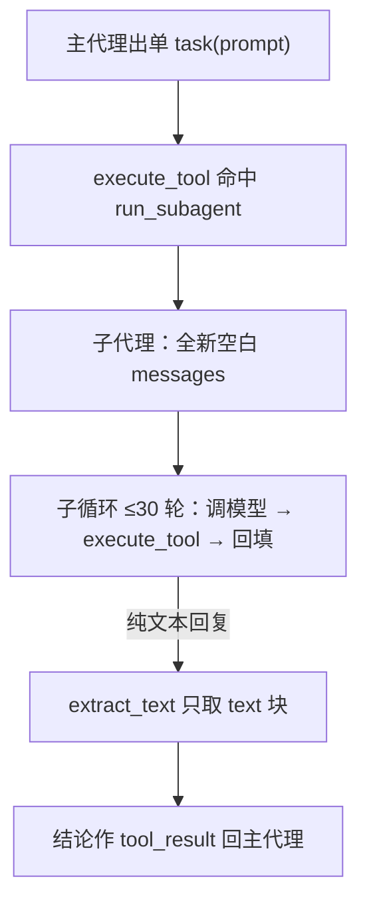
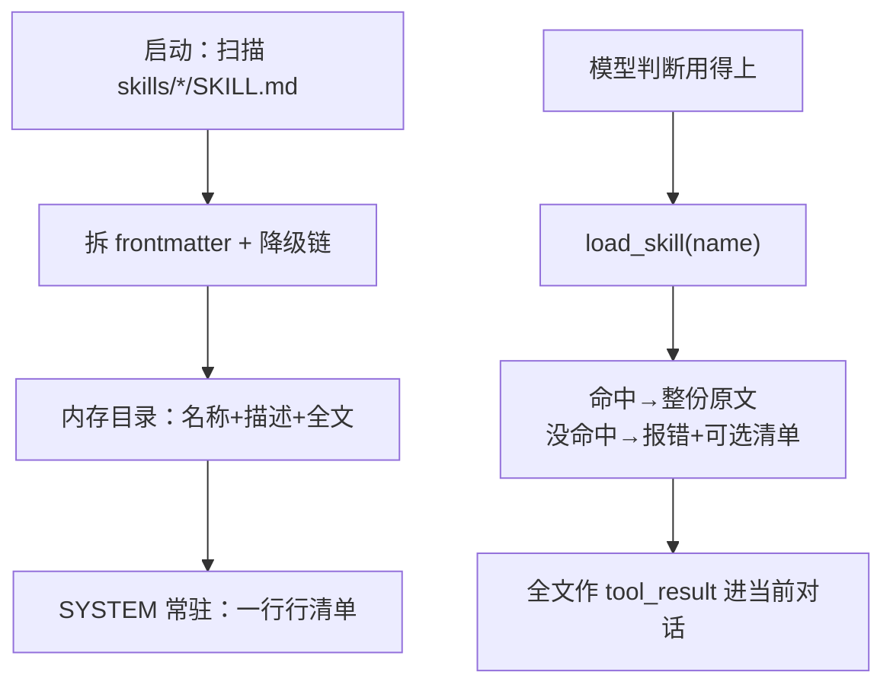

# 第 7 课总结 · 复习专用

## 一、上节课（第 6 课 · Subagent）的流程



伪代码：

```
def run_subagent(prompt):
    messages = [user: prompt]           # 全新空白
    for _ in range(30):
        response = 模型(SUB_SYSTEM, messages, tools=基础池)  # 无 task 防套娃
        if 纯文本: return extract_text(response)
    return "30 轮未完成"
PARENT_TOOLS = [*TOOLS, TASK_TOOL]
```

## 二、这节课（第 7 课 · Skill Loading）的流程



伪代码：

```
def parse_frontmatter(text):          # 手工行扫描 + yaml.safe_load
    首行不是 --- 或找不到结尾 → 返回 ({}, 原文)

class SkillLoader:
    scan():   glob("*/SKILL.md") → 解析 → name缺用目录名 / desc缺用正文首行
    catalog(): "- 名字: 描述" 逐行（常驻 SYSTEM，便宜）
    load(name): 命中返回整份原文；没命中 → Error + Available 清单

SYSTEM = build_system_prompt()        # 岗位说明 + Skills available: 目录
```

## 三、这节课在上节基础上加了什么

| 位置 | 加了什么 |
|---|---|
| `mini_claude/skills.py`（全新） | parse_frontmatter（行扫描+safe_load+全降级）；SkillLoader（启动扫盘一次、catalog 目录视图、load 按需全文+报错附选项）；模块级 LOADER；SKILL_TOOL |
| `skills/`（数据目录，全新） | 四个示例技能：agent-builder / code-review / pdf / mcp-builder（借自原项目） |
| `mini_claude/loop.py` | SYSTEM 改为 build_system_prompt() 组装式，拼入技能目录与使用指导 |
| `mini_claude/tools.py` | TOOLS/TOOL_HANDLERS 登记 load_skill（handler 直接用绑定方法） |
| `requirements.txt` | pyyaml>=6.0（课程第一个新第三方依赖） |

**借助的新库/新表**：pyyaml（import 名是 yaml；用 safe_load 不用 load）；无数据库表；无文件写入（技能文件是读入的数据）。

**一句话增量**：知识从"全量塞 SYSTEM"变成"目录常驻 + load_skill 按需"；扩展新本事的方式从改代码变成加文件。

## 四、自测三问

1. 两级加载各发生在什么时刻？各自花什么钱？（启动扫一次盘建目录，目录随 SYSTEM 每轮常驻很便宜；全文只在模型 load 那轮进对话，一次性）
2. frontmatter 缺 name / 缺 description 怎么办？（降级链：目录名顶上 / 正文第一行顶上——残缺数据给体面默认值）
3. load_skill 的结果会常驻 SYSTEM 吗？（不会，进的是当前对话的 tool_result；这也是它便宜的原因）
